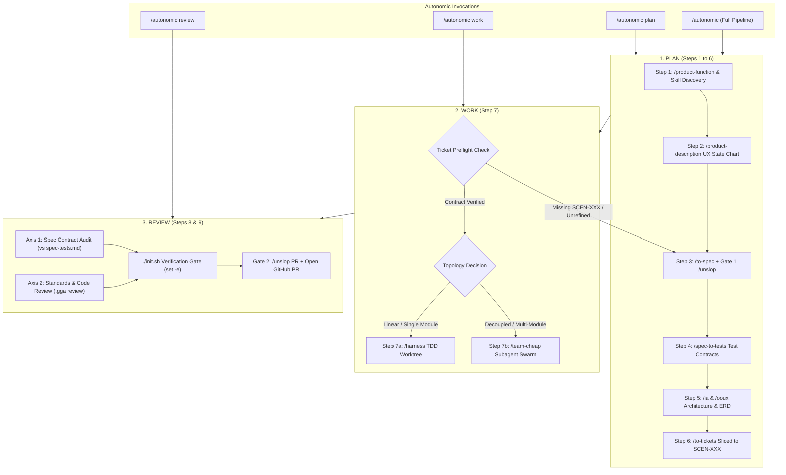

# Autonomic Product Builder (3-Phase Macro Architecture)

The master autonomous product orchestration engine for `agent-boilerplate`.

Invoking **`/autonomic <idea>`** executes the entire pipeline end-to-end (`Plan` ➔ `Work` ➔ `Review`). When granular execution is preferred, each phase can be triggered independently:
- **`/autonomic plan [idea]`**: Executes Steps 1 through 6 (Scope ➔ Specs ➔ Test Contracts ➔ Architecture ➔ Tickets).
- **`/autonomic work [ticket]`**: Executes Step 7 (Ticket Preflight ➔ `/harness` TDD Red-Green-Refactor).
- **`/autonomic review [branch]`**: Executes Steps 8 & 9 (Two-Axis Contract & Standards Audit ➔ Gate 2 PR).

---

## The 3-Phase State Machine



---

## Phase 1: PLAN (Steps 1 to 6)

When invoked via `/autonomic plan <idea>`:

### Step 1: Product Discovery & Dynamic Skill Discovery (`/product-function` + `/find-skills`)
- Model the feature as a transformation function $y = f(x)$ based on Ryan Singer's methodology.
- Apply **10x Scope-Stripping** to eliminate speculative fluff.
- **Proactive 4-Pillar Skill Check**: If the scoped product requires specialized domain expertise (Stripe, SQLite, Three.js, WebSockets), discover and install skills via `npx skills find "<domain>"`.
- Target: `docs/product-design/product_function.md`.

### Step 2: Behavioral UX State Chart (`/product-description`)
- Author outside-in user experience documentation in `docs/product-description/`.
- Detail the 5 interaction phases with a Mermaid `stateDiagram-v2` and complete the 5-family interrupt checklist.

### Step 3: Formal Specifications & Gate 1 (`/to-spec` + `/unslop`)
- Generate formal acceptance criteria and domain contracts in `openspec/specs/<feature>/spec.md` directly from the behavioral model.
- **🟢 GATE 1: `/unslop`**: Strip corporate filler, vague adjectives, and marketing jargon.

### Step 4: Spec-Derived Behavioral Test Contract (`/spec-to-tests`)
- Extract pure, implementation-free behavioral scenarios (`SCEN-001`..N) and error invariants directly from `spec.md`.
- Target: `openspec/changes/<change>/spec-tests.md` **before** technical design to eliminate tautological testing.

### Step 5: Information Architecture & Domain Modeling (`/ia` & `/ooux`)
- Generate navigation hierarchy, user journeys, and sitemaps (`docs/product-design/ia.md`).
- Extract core entities, object cards, metadata, and ERD (`docs/product-design/ooux.md`).

### Step 6: Atomic Ticket Decomposition (`/to-tickets`)
- Break down architecture into discrete tracer-bullet tickets in `openspec/changes/<change>/tasks.md` and individual tickets in `tickets/`.
- **Mandatory Binding**: Each implementation ticket binds explicitly to its target Scenario ID (`SCEN-XXX`).

---

## Phase 2: WORK (Step 7)

When invoked via `/autonomic work [ticket]` or sequenced after Phase 1:

### Ticket Preflight Protocol (MANDATORY)
Before writing any code or modifying tests:
1. **Scenario Binding Audit**: Verify the ticket references a valid `SCEN-XXX` contract from `spec-tests.md`.
2. **Acceptance Criteria Clarity**: Confirm inputs, outputs, and boundary conditions are unambiguous.
3. **Refinement Intercept**: If the ticket is unrefined or lacks a test scenario contract, **HALT** implementation and route the ticket back through Phase 1 (`/to-spec` ➔ `/spec-to-tests`) to author the contract first. Never code uncontracted work.

### Step 7: Autonomous Execution Routing (`/harness` vs `/team-cheap`)
1. **Default Linear / Single-Module Route (`/harness`)**:
   - Spawns an isolated worktree subagent via `Workspace: 'share'`.
   - Executes Red ➔ Green ➔ Refactor TDD on each task unit in sequence against its assigned Scenario ID.
2. **Parallel Swarm Route (`/team-cheap`)**:
   - If tasks span decoupled boundaries (e.g. Frontend UI vs Database Schema vs API Services), dispatch `/team-cheap` to fan out parallel `/harness` subagents.

---

## Phase 3: REVIEW (Steps 8 & 9)

When invoked via `/autonomic review [branch]` or sequenced after Phase 2:

### Two-Axis Verification Gate
1. **Axis 1 (Spec Contract Compliance)**:
   - Audit implementation directly against the Red-ready test contracts in `spec-tests.md`.
   - Verify tests test business invariants and real seams, rather than asserting implementation trivia or mocking out core logic.
2. **Axis 2 (Standards & Architectural Compliance)**:
   - Run automated `.gga` pre-commit review against Section 6 coding rules (Hexagonal boundaries, strict typing, integer cents, no raw `any`).
   - Run `./init.sh` with `set -e` (0 typecheck errors, 100% test pass rate).

### Step 9: Delivery & Gate 2 (`/unslop` PR)
- **🟢 GATE 2: `/unslop`**: Generate a concise 2–4 sentence PR description without corporate filler.
- Create topic branch (`{prefix}/CCH/{project-initials}-{ticket-number}-{ticket-summary}`), push, and open the Pull Request with automated labels.

---

## Usage

```bash
# 1. Full end-to-end pipeline
/autonomic "Build a markdown task manager with SQLite persistence"

# 2. Planning phase only (Steps 1-6)
/autonomic plan "Add multi-currency conversion to dual-ledger"

# 3. Work phase only (Step 7: Ticket Preflight + TDD)
/autonomic work openspec/changes/dual-cashflow-budgeting/tickets/03-pos-quick-capture-modal.md

# 4. Review phase only (Steps 8-9: Two-Axis Audit + PR)
/autonomic review feature/CCH/ALM-003-pos-quick-capture
```
