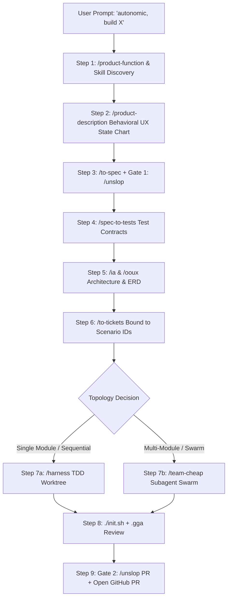

# Autonomic Product Builder

The master autonomous product orchestration engine for `agent-boilerplate`.

When invoked via `/autonomic <idea>` or `"autonomic, build an app that does X, Y, Z"`, this orchestrator executes the complete product-to-code pipeline sequentially without requiring manual phase triggers.

---

## The Autonomous Product State Machine



---

## Execution Protocol

### Step 1: Product Discovery & Dynamic Skill Discovery (`/product-function` + `/find-skills`)
- Model the feature as a transformation function $y = f(x)$ based on Ryan Singer's methodology.
- Apply **10x Scope-Stripping** to eliminate speculative fluff.
- **Proactive 4-Pillar Skill Check**: If the scoped product requires specialized domain expertise (e.g. Stripe, Three.js, pgvector, WebSockets, specialized UI), query `npx skills find "<domain>"` to discover and install relevant skills before architecture design.
- Write the scoped model to `docs/product-design/product_function.md`.

### Step 2: Behavioral UX State Chart (`/product-description`)
- Author the outside-in user experience documentation in `docs/product-description/`.
- Detail the 5 interaction phases (starting, instant end, extended, while extended, finishing) with a Mermaid `stateDiagram-v2`.
- Complete the 5-family interrupt checklist (abort, mid-way distraction, clean complete, network/environment failure, target mutation/channel change).

### Step 3: Formal Specifications & Gate 1 (`/to-spec` + `/unslop`)
- Generate formal acceptance criteria and domain contracts in `openspec/specs/<feature>/spec.md` directly from the behavioral UX model.
- **🟢 GATE 1: `/unslop`**: Run `/unslop` across the generated specs to ensure zero AI fluff or ambiguous metaphors.

### Step 4: Spec-Derived Behavioral Test Contract (`/spec-to-tests`)
- Extract pure, implementation-free behavioral scenarios (`SCEN-001`..N) and error invariants directly from `spec.md`.
- Write the test contract to `openspec/changes/<change>/spec-tests.md` **before** technical design to eliminate tautological testing and technical contamination.

### Step 5: Information Architecture & Domain Modeling (`/ia` & `/ooux`)
- Generate navigation hierarchy, user journeys, and sitemaps (`docs/product-design/ia.md`).
- Extract core entities, object cards, metadata, and ERD (`docs/product-design/ooux.md`).

### Step 6: Atomic Ticket Decomposition (`/to-tickets`)
- Break down the architecture into discrete, test-first tickets in `openspec/changes/<change>/tasks.md`.
- Each implementation ticket binds explicitly to its target Scenario ID (`SCEN-XXX`).

### Step 7: Autonomous Execution Routing (`/harness` vs `/team-cheap`)
Analyze the workload topology:
1. **Default Linear / Single-Module Route (`/harness`)**:
   - Spawns an isolated worktree subagent via `Workspace: 'share'`.
   - Executes Red ➔ Green ➔ Refactor TDD on each task unit in sequence against its assigned Scenario ID.
2. **Parallel Swarm Route (`/team-cheap`)**:
   - If the tasks span decoupled boundaries (e.g. Frontend UI vs Database Schema vs API Services), dispatch `/team-cheap` to fan out parallel `/harness` subagents (Gemini Flash for bulk, Gemini Pro for hard reviews).

### Step 8: Verification & Quality Gate
- Execute `./init.sh` to confirm zero test or build failures (`set -e`).
- Audit staged diffs with `.gga` pre-commit AI code review and `/code-review` (Spec + Standards compliance).

### Step 9: Delivery & Gate 2 (`/unslop` PR)
- **🟢 GATE 2: `/unslop`**: Generate a crisp 2–4 sentence PR description without corporate filler.
- Create the topic branch (`{prefix}/CCH/{project-initials}-{ticket-number}-{ticket-summary}`), push, and open the Pull Request with automated labels.

---

## Usage

```text
/autonomic "Build a markdown task manager with SQLite persistence and tagging"
autonomic, build an invoice generator with PDF export and stripe webhook integration
```
