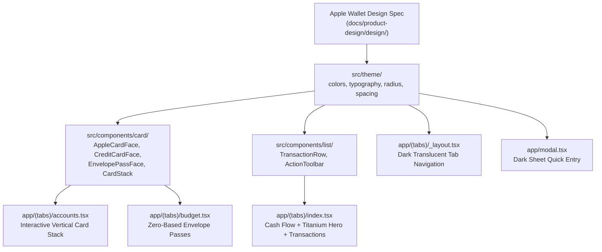

# Implementation Plan: Apple Wallet Design System Integration

## Goal Description
Integrate the production-grade **Apple Wallet (iOS) design system** documented in [`docs/product-design/design/`](file:///Users/cesaradalbertochavezcalderon/orca/workspaces/almotacen/langouste/docs/product-design/design/) into Almotacen. 

This unifies Almotacen's dual Monarch + YNAB financial architecture (Cash Flow + Zero-Based Envelope Budgeting + Accounts) with Apple Wallet's signature visual language:
- **Canvas & Atmosphere**: True black (`#000000`) canvas with floating cards, high-contrast typography, and glass overlays.
- **Physical Card Mechanics**: Vertical `CardStack` with an 80pt peek, 10pt-radius card envelopes, physical depth shadows, and interactive spring expand/collapse physics.
- **Signature Card Faces**: Apple Card titanium gradient (`#E8E8EB → #A8A8AD → #3D3D3F`) with gold chip and daily cash accents; issuer-branded credit/depository cards; and PassKit-inspired perforated envelope passes.
- **Typography & Details**: SF Pro Display (≥20pt) & SF Pro Text (≤17pt), tabular numerals (`tabular-nums`) for currency, uppercase 13pt section headers, and grouped inset transaction rows with `#262629` hairlines.

---

## User Review Required

> [!IMPORTANT]
> **True Black Canvas Adoption**: The app background across all screens and the root layout will be set to `#000000` (true black), replacing the default light `#FFFFFF` theme. This is the cornerstone of the Apple Wallet design spec so cards float with physical depth.

> [!IMPORTANT]
> **Dependency Addition**: We will install `expo-linear-gradient` (for authentic 3-stop titanium and branded card gradients) and `expo-haptics` (for tactile card tap/expansion feedback).

---

## Proposed Changes

---

### 1. Dependencies & Configuration

#### `package.json`
- Install `expo-linear-gradient` and `expo-haptics` using `npx expo install expo-linear-gradient expo-haptics`.

---

### 2. Design System Tokens (`src/theme/`)

#### [MODIFY] `src/theme/colors.ts`
Update color palette to match `docs/product-design/design/DESIGN-expo.md`:
- `canvas`: `#000000` (True black)
- `surface1`: `#1C1C1E` (Grouped list rows, card detail background)
- `surface2`: `#2C2C2E` (Pressed states, icon circles)
- `glass`: `rgba(255, 255, 255, 0.12)` (Pills, circular action buttons)
- `hairline`: `#262629` (Row separators)
- `titaniumHi`: `#E8E8EB`, `titaniumMid`: `#A8A8AD`, `titaniumLo`: `#3D3D3F`
- `chipGold`: `#C7AC73`, `dailyCash`: `#FF3B30`
- `chaseBlue`: `#1A2D4F`, `amexSilver`: `#A7B0B7`, `visaNavy`: `#1A1F71`
- `systemBlue`: `#0A84FF`, `success`: `#30D158`, `warning`: `#FF9F0A`, `error`: `#FF453A`

#### [MODIFY] `src/theme/typography.ts`
Implement the dual-axis typography ramp:
- Display ramp: `title` (34pt, 700), `sheetTitle` (28pt, 700), `cardIssuer` (17pt, 600), `balanceHero` (40pt, 700, tabular-nums), `dailyCash` (22pt, 700).
- Text ramp: `body` (17pt, 400), `bodyMedium` (17pt, 500, tabular-nums), `action` (17pt, 600), `sectionHdr` (13pt, 600, uppercase), `footnote` (13pt, 400), `caption` (11pt, 400).
- Mono ramp: `cardLast4` (17pt, 500, tabular-nums).

#### [MODIFY] `src/theme/radius.ts`
- `card`: `10` (Apple Wallet signature card envelope radius)
- `pill`: `9999` (Capsules and circular buttons)
- `sheet`: `14` (Action sheets and modals)

---

### 3. Reusable Signature Components (`src/components/`)

#### [NEW] `src/components/AppleCardFace.tsx`
- 3-stop titanium gradient (`#E8E8EB → #A8A8AD → #3D3D3F`).
- Embossed gold chip glyph (`26x20pt`, `#C7AC73`).
- Cupertino logo icon top-right.
- Cardholder name embossed in dark text on titanium.
- Daily Cash red badge with white `$` indicator.
- 0.5pt inner highlight hairline.

#### [NEW] `src/components/CreditCardFace.tsx`
- Generic branded financial card face supporting linear gradient backgrounds (Chase Sapphire, Amex, Capital One, Wells Fargo).
- Issuer text, network badge (Visa, Mastercard, Amex), cardholder name, and masked `•••• last4`.
- Standard Wallet card envelope dimensions (`height: 220`, `borderRadius: 10`, `elevation: 12`, physical shadow).

#### [NEW] `src/components/EnvelopePassFace.tsx`
- PassKit-inspired boarding-pass / envelope card face for zero-based budget categories.
- Top section: Envelope category name, target allocation, and status pill.
- Center: Perforated hairline divider with side circular notches.
- Bottom: Available balance, activity indicator, and progress tracker.

#### [NEW] `src/components/CardStack.tsx`
- Vertical card stack component with 80pt peek overlap.
- Spring physics via `react-native-reanimated` (`damping: 16`, `mass: 0.8`).
- Tap-to-expand / accordion interaction with tactile feedback via `expo-haptics`.

#### [NEW] `src/components/TransactionRow.tsx`
- Inset row on `surface1` (`#1C1C1E`) with `hairline` (`#262629`) bottom border.
- 32pt circular icon container on `surface2`.
- Merchant title, secondary timestamp/category, and right-aligned amount with tabular numerals.

---

### 4. Screen Integrations (`app/(tabs)/` & `app/`)

#### [MODIFY] `app/(tabs)/_layout.tsx`
- Configure true-black theme (`colors.canvas = #000000`).
- Tab bar styling with dark glass background, active tint `#0A84FF`, and clean symbols.
- Quick entry modal trigger in top header with glass circular button.

#### [MODIFY] `app/(tabs)/index.tsx` (Cash Flow)
- True black canvas.
- Hero Net Flow Card styled with the Apple Card Titanium finish (`#E8E8EB → #3D3D3F`).
- Reactive flow stats row with inset dark cards (`#1C1C1E`) and green/red indicators.
- Month velocity progress bar.
- "Recent Outflows" section utilizing `TransactionRow`.
- Design system Action Button "+ Log Quick Expense".

#### [MODIFY] `app/(tabs)/budget.tsx` (Zero-Based Envelopes)
- Zero-based "Ready to Assign" banner styled with PassKit transit badge aesthetics.
- Category groups (Immediate Obligations, True Expenses, Quality of Life) rendered with `EnvelopePassFace` cards and category progress bars.

#### [MODIFY] `app/(tabs)/accounts.tsx` (Accounts & Ledgers)
- Net Worth hero header.
- Interactive `CardStack` rendering:
  - Apple Card Titanium Face (Primary Cash Flow & Daily Cash)
  - Chase Sapphire Preferred Face (Credit Card Liability)
  - High-Yield Savings Face (Marcus Depository)
  - Vanguard Total Stock Market Face (Investment Asset)
- Tapping any card expands it with spring physics to reveal account balance details and masked numbers.

#### [MODIFY] `app/modal.tsx` (Quick Expense Entry)
- True-black sheet presentation.
- Glass text inputs (`surface1` with subtle border).
- Category and account picker pills.
- High-contrast "Log Transaction" action button.

---

## Verification Plan

### Automated Tests
- Type checking: `npm run typecheck` (`tsc --noEmit`) to verify 0 typing errors across new components.
- Unit & Behavioral tests: `npm test` (`jest`) to ensure the pure ledger engine tests remain 100% green.
- Initialization test: `./init.sh` to run the full harness verification suite.

### Manual Verification via Playwright
- Navigate to `http://localhost:8082/` (Cash Flow):
  - Take screenshot to verify true-black canvas, titanium card hero, and transaction list.
- Navigate to `http://localhost:8082/budget` (Budget):
  - Take screenshot to verify Ready to Assign zero-based banner and envelope passes.
- Navigate to `http://localhost:8082/accounts` (Accounts):
  - Take screenshot to verify vertical `CardStack` with 80pt peek and card faces.
  - Click a card to verify expand interaction and spring animation.
- Open `/modal`:
  - Verify quick entry form on dark sheet canvas.
