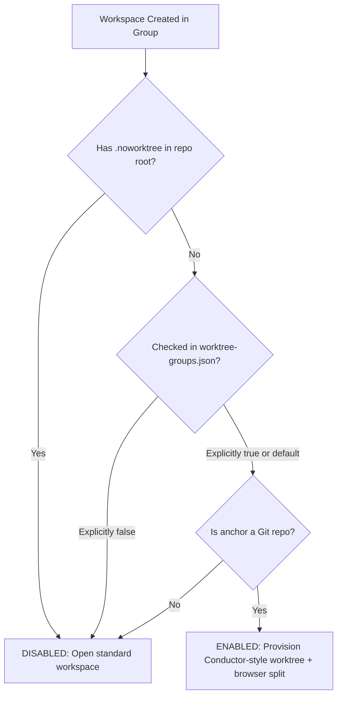

# Implementation Plan: Conductor-Style Git Worktrees with cmux Browser Integration & Per-Group Toggles

## Goal Description
Implement a Conductor-inspired Git worktree workflow directly in `cmux` for workspace groups, while providing **granular per-group enable/disable controls** so projects that cannot or should not use worktrees run as standard workspaces without prompts or file copies.

Key capabilities:
1. **Per-Group Toggle**: Enable or disable worktree generation per group tab (via CLI command `cwt`, global config `~/.config/cmux/worktree-groups.json`, or a project marker `.noworktree`).
2. **Conductor-Style Worktree Isolation**: For enabled groups, automatically provision an isolated worktree at `<repo-worktrees>/<slug>`, copying `.env`, `.env.local`, and `.worktreeinclude` files.
3. **cmux Browser Split Integration**: Automatically open a side-by-side browser split loading the GitHub/Linear issue or PR context.
4. **Atomic Renaming (`cwr`)**: Atomically rename branch, worktree directory, workspace title, and browser URL when issue details become available.

---

## Per-Group Enable / Disable Design

### 3 Flexible Ways to Control Per-Group Behavior

| Method | Where It Lives | How It Works |
|---|---|---|
| **1. Fast Command Toggle (`cwt`)** | CLI in any workspace | Run `cwt toggle` (or `cwt off` / `cwt on`) to toggle worktrees for the current group immediately. |
| **2. Global Group Registry** | `~/.config/cmux/worktree-groups.json` | Stores a map of group names or paths to `true`/`false`. |
| **3. Project Marker File** | `.noworktree` in project root | Adding a `.noworktree` file in a repository root permanently disables worktree generation for that project. |

### Evaluation Order
When a workspace is created inside a group:


---

## Proposed Changes

### Component 1: Core Automation Scripts (`~/.config/cmux/bin/`)

#### [NEW] `~/.config/cmux/bin/cmux-worktree-toggle` (alias: `cwt`)
Group toggle manager:
- Detects the current group from `$CMUX_WORKSPACE_ID` or takes `--group <name|ref>`.
- Subcommands: `cwt on`, `cwt off`, `cwt status`, `cwt toggle`.
- Updates `~/.config/cmux/worktree-groups.json`.
- Prints a clear one-line confirmation:
  ```text
  🌿 Worktrees for group 'Craft CMS': DISABLED
  ```

#### [NEW] `~/.config/cmux/bin/cmux-group-worktree`
Primary worktree runner:
- Checks if worktrees are enabled for the target group before running. If disabled, creates a standard workspace using the group's root directory.
- For enabled groups:
  - Prompts for or parses issue URL / ticket slug.
  - Provisions worktree at `<parent>/<repo>-worktrees/<slug>`.
  - Syncs `.env`, `.env.local`, and `.worktreeinclude` files.
  - Spawns workspace: `cmux new-workspace --group "$GROUP" --cwd "$WORKTREE" --name "$BRANCH"`.
  - Spawns browser split: `cmux browser open-split "$ISSUE_URL" --workspace "$NEW_WS_ID"`.

#### [NEW] `~/.config/cmux/bin/cmux-init-worktree`
Interactive terminal bootstrap:
- Checks if group has worktrees enabled. If disabled, exits immediately (zero friction).
- If enabled: prompts for issue URL or scratch worktree, performs directory move, and opens browser split.

#### [NEW] `~/.config/cmux/bin/cmux-worktree-rename` (`cwr`)
Atomic rename utility:
- Renames Git branch (`git branch -m`).
- Moves worktree directory (`git worktree move`).
- Renames cmux workspace sidebar title (`cmux workspace rename`).
- Navigates existing cmux browser split to new issue URL if applicable.

#### [NEW] `~/.config/cmux/bin/cmux-worktree-daemon`
Background event listener:
- Monitors `cmux events` for `workspace.created`.
- Evaluates per-group eligibility (`worktree-groups.json` and `.noworktree`).
- Only triggers worktree setup for enabled groups.

---

### Component 2: Background Service Daemon (`~/Library/LaunchAgents/`)

#### [NEW] `~/Library/LaunchAgents/com.cmux.worktree-daemon.plist`
- Supervises `cmux-worktree-daemon`.
- Auto-starts on login and keeps daemon alive.

---

### Component 3: cmux Configuration (`~/.config/cmux/cmux.json`)

#### [MODIFY] `~/.config/cmux/cmux.json`
- Backs up existing file to `cmux.json.bak.<timestamp>`.
- Registers `"conductor-worktree"` action under `actions`.
- Binds context-menu under `workspaceGroups.byCwd` for group `+` button.

---

## Verification Plan

### Automated Verification
1. `cwt status`: inspects toggle states.
2. Run test toggle: `cwt off` on group, verify `workspace.created` produces a standard workspace without worktree creation.
3. Turn `cwt on` on group, verify worktree creation resumes.

### Manual Verification
1. Test Disabled Group:
   - Add `.noworktree` to a test repo, or run `cwt off`.
   - Click `+` in that group: verify normal terminal opens in root CWD with no prompt.
2. Test Enabled Group:
   - In `💵 Almotacen`, click `+`: verify Conductor worktree prompt + browser split launch.
   - Run `cwr` to verify rename flow.
