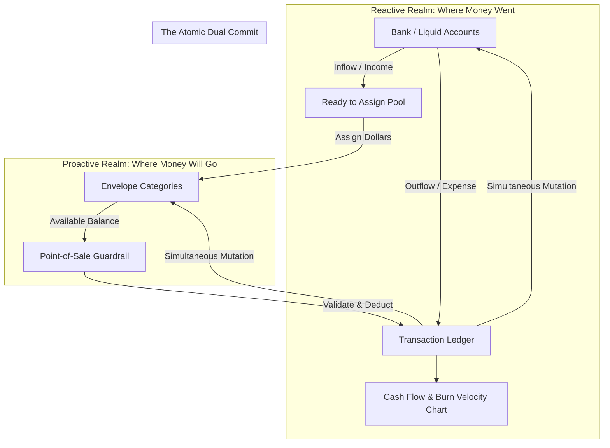

# Architecture & Product Thesis Plan: The Dual-Engine Core

## 1. Goal Description & Verification of Thesis
The user's statement:
> *"A product that can handle a reactive cash flow manager that shows you where your money went, and is a proactive budgeting tool that forces you to decide where your money will go"*

This statement is **verified and accurate** against the repository architecture documented in:
- [`CONTEXT.md`](file:///Users/cesaradalbertochavezcalderon/Personal/almotacen/CONTEXT.md#L10-L12)
- [`docs/product-design/product_function.md`](file:///Users/cesaradalbertochavezcalderon/Personal/almotacen/docs/product-design/product_function.md#L7-L8)
- [`docs/product-description/foundations/ledger_model.md`](file:///Users/cesaradalbertochavezcalderon/Personal/almotacen/docs/product-description/foundations/ledger_model.md#L4-L11)

### The Structural Problem Being Solved
Most financial applications fail because they pick only one side of the coin:
1. **Passive Trackers (Monarch Money, Mint)**: They show you where money went after it left your hands. By the time you see the chart, the money is already gone. Zero behavioral friction to prevent overspending.
2. **Pure Envelope Tools (YNAB)**: They demand high cognitive discipline and desktop reconciliation. The moment accounts drift or point-of-sale logging is delayed, friction causes the user to abandon the system.

`almotacen` unifies both through a **Dual-Sided Ledger Engine**:
- **Realm 1: Physical Accounts (Reactive)**: Tracks liquid reality ($\sum \text{Checking} + \text{Savings} - \text{Credit Cards}$).
- **Realm 2: Behavioral Envelopes (Proactive)**: Forces zero-based allocation where every dollar is given a job before it is spent ($\sum \text{Envelopes} + \text{Ready to Assign} = \text{Liquid Reality}$).

---

## 2. Core Architectural Model

---

## 3. Implementation Alignment & Roadmap

To ensure the codebase strictly reflects this dual thesis:

### Component 1: Dual-Entry Ledger Engine (`src/domain/ledger/`)
- Inflows directly credit Account and increment `readyToAssignCents`.
- Outflows directly debit Account and debit Category `availableCents`.
- Overspending is visually flagged and adjusts future allocations.

### Component 2: Reactive Cash Flow (`app/(tabs)/index.tsx`)
- Computes daily burn velocity against calendar progress (e.g. 50% through month, 38% spent).
- Surfaces trajectory graphs so the user sees trends without manual spreadsheet math.

### Component 3: Proactive Envelope Allocator (`app/(tabs)/budget.tsx`)
- Enforces Zero-Based Budgeting ($0.00 unassigned goal).
- Offers quick-allocation presets (Underfunded, Past Average, Clear).

### Component 4: Low-Friction POS Capture (`app/modal.tsx`)
- Sub-3-second entry to eliminate point-of-sale friction.
- Shows live impact on envelope balance before committing.

---

## 4. Verification Plan
1. **Mathematical Invariant Test**: Prove that $\sum \text{Liquid Accounts} \equiv \sum \text{Assigned Envelopes} + \text{Ready to Assign}$ under all inflows, outflows, and transfers.
2. **Zero-Lag Offline Execution**: Verify SQLite local transactions execute in $<16\text{ms}$ without waiting on Supabase network roundtrips.
