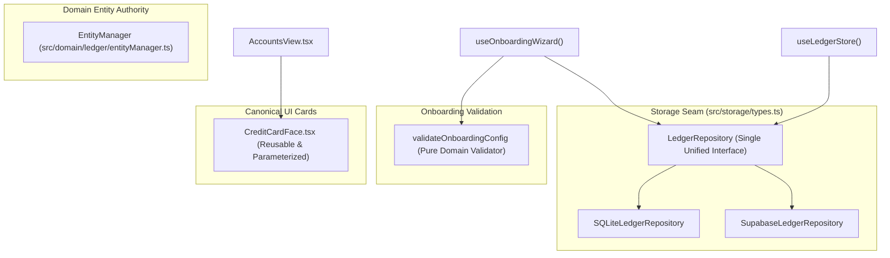

# Implementation Plan: Deep Module Consolidation & Shallow Pass-Through Cleanup

**Change ID**: `deep-module-consolidation`  
**Target Milestone**: Codebase Design & Seam Consolidation  
**Target Branch**: `main` (via feature branches per ticket)  

---

## 1. Problem Statement & Motivation
Following an architectural audit using the principles of **Codebase Design** (depth as leverage, real vs hypothetical seams, and the deletion test), we uncovered five areas where code complexity is shallow, speculative, or pass-through:
1. `src/domain/ledger/entityOperations.ts`: Empty 9-line re-export with zero callers.
2. `src/storage/useLedgerStore.ts`: Three dead 1-line hook wrappers (`useLedgerTransactions`, `useEntityCatalog`, `useLedgerAdmin`).
3. `src/storage/ports/`: Slicing `LedgerRepository` across 4 files into sub-ports that zero consumers use in isolation.
4. `src/domain/onboarding/onboardingService.ts`: Middleman `commitOnboardingConfig` wrapper and `OnboardingRepository` port that duplicate `LedgerRepository.commitOnboardingConfig`.
5. `src/components/AppleCardFace.tsx`: 136-line hardcoded mockup with zero screen callers, coexisting with the reusable `CreditCardFace.tsx`.

Applying the **Deletion Test**: deleting these pass-throughs removes file sprawl, cognitive overhead, and indirection without adding complexity to callers.

---

## 2. Proposed Architecture & Consolidated Seams

---

## 3. Atomic Implementation Tickets

### Ticket 01: Delete `entityOperations.ts` Pass-Through (`SCEN-018`)
- Remove `src/domain/ledger/entityOperations.ts`.
- Verify all entity planning operations import `EntityManager` directly.
- Verify `./init.sh` green pass.

### Ticket 02: Remove Dead Port Hooks from Store (`SCEN-019`)
- Remove `useLedgerTransactions()`, `useEntityCatalog()`, and `useLedgerAdmin()` from `src/storage/useLedgerStore.ts`.
- Clean up unused imports in `useLedgerStore.ts`.
- Verify `./init.sh` green pass.

### Ticket 03: Consolidate Storage Ports into Unified Repository Seam (`SCEN-020`)
- Inline all transaction, catalog, and admin method contracts into `LedgerRepository` in `src/storage/types.ts`.
- Delete `src/storage/ports/` directory (`index.ts`, `ledgerTransactionsPort.ts`, `entityCatalogPort.ts`, `ledgerAdminPort.ts`).
- Refactor `src/storage/__tests__/portSegregation.test.ts` to `src/storage/__tests__/repositoryContract.test.ts` asserting `LedgerRepository`.
- Verify `./init.sh` green pass.

### Ticket 04: Remove Onboarding Service Wrapper & Legacy Port (`SCEN-021`)
- Remove `commitOnboardingConfig` pass-through from `src/domain/onboarding/onboardingService.ts`.
- Remove `OnboardingRepository` interface from `src/domain/onboarding/types.ts`.
- Refactor `src/domain/onboarding/__tests__/onboardingService.test.ts` to test `validateOnboardingConfig` assertions directly.
- Verify `./init.sh` green pass.

### Ticket 05: Remove Dead `AppleCardFace.tsx` Component (`SCEN-022`)
- Delete `src/components/AppleCardFace.tsx`.
- Remove `AppleCardFace` export from `src/components/index.ts`.
- Update `src/components/__tests__/FinancialCardsAccessibility.test.tsx` to assert `CreditCardFace` accessibility.
- Verify `./init.sh` 100% green pass across all 35 suites.

---

## 4. Verification & Quality Gates
- **Anti-Tautology & Behavior**: Acceptance criteria locked in `openspec/changes/deep-module-consolidation/spec-tests.md`.
- **Automated Verification**: `./init.sh` must execute with 0 test failures and 0 typecheck errors.
- **AI Review Guardrail**: `.gga` pre-commit review must pass on all tickets.
- **Git Flow**: Each ticket developed on topic branch `refactor/CCH/ALM-030-ticket-XX`, reviewed, and merged via PR.
