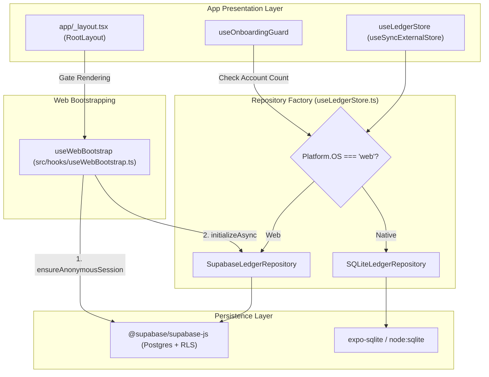

# Implementation Plan: Web Supabase Integration (Ticket 03 - Platform Factory & Web Bootstrapping)

## Metadata
- **Ticket**: `03-platform-factory-and-web-bootstrapping`
- **Bound Scenarios**: [`SCEN-008`](../../openspec/changes/web-supabase-integration/spec-tests.md#scen-008-platform-specific-repository-factory)
- **Branch**: `feature/CCH/ALM-023-platform-factory-and-web-bootstrapping`
- **Target**: Production Web & Native Dynamic Repository Routing

---

## 1. Problem Statement & Architecture Context

Almotacen is an Expo / React Native application targeting both iOS / Android native devices and Web browsers:
- On native (iOS/Android), persistence uses `expo-sqlite` through `SQLiteLedgerRepository` with synchronous queries.
- On web, `expo-sqlite` worker synchronization is prone to thread timeouts, SharedArrayBuffer blocks, and browser crashes. In Tickets 01 and 02, we established the Postgres schema with RLS and built `SupabaseLedgerRepository` with zero-latency in-memory caching and optimistic background synchronization.
- **The Gap**: Currently, `useLedgerStore.ts` and `useOnboardingGuard.ts` hardcode calls to `getDatabase()` and instantiate `SQLiteLedgerRepository`. If accessed in a web browser, the app attempts to open SQLite and crashes. Furthermore, `SupabaseLedgerRepository` requires an asynchronous initialization phase (`initializeAsync`) and anonymous auth handshake (`ensureAnonymousSession`) before the store snapshot can be rendered without flashing empty state.

---

## 2. Technical Architecture & Hexagonal Boundaries



---

## 3. Detailed Implementation Steps

### Step 1: Author `src/hooks/useWebBootstrap.ts`
Implement a specialized bootstrap hook encapsulating the asynchronous startup lifecycle for web environments:
```typescript
export interface WebBootstrapState {
  isReady: boolean;
  error: Error | null;
}

export function useWebBootstrap(): WebBootstrapState;
```
- **Web Runtime (`Platform.OS === 'web'`)**:
  1. Calls `ensureAnonymousSession()` from `src/storage/supabase/client.ts`.
  2. Resolves the `SupabaseLedgerRepository` instance from `getRepository()`.
  3. Awaits `repo.initializeAsync()` to hydrate `BudgetState` and `CategoryGroup[]` into memory.
  4. Sets `isReady: true`.
  5. Catches any rejection and sets `error: Error`.
- **Native Runtime (`Platform.OS !== 'web'`)**:
  - Immediately initializes with `{ isReady: true, error: null }` (zero latency, SQLite requires no async bootstrap).

### Step 2: Implement Platform-Aware Repository Factory in `src/storage/useLedgerStore.ts`
1. Update `getRepository()`:
   ```typescript
   export function getRepository(): LedgerRepository {
     if (!repositoryInstance) {
       if (Platform.OS === 'web') {
         const client = getSupabaseClient();
         const repo = new SupabaseLedgerRepository(client);
         // Forward internal repository rollback / mutation notifications to useLedgerStore subscribers
         repo.subscribe(() => {
           notifyListeners();
         });
         repositoryInstance = repo;
       } else {
         const db = getDatabase();
         repositoryInstance = new SQLiteLedgerRepository(db);
       }
     }
     return repositoryInstance;
   }
   ```
2. Export `resetRepositoryInstanceForTesting()` to facilitate isolated unit testing between platforms.

### Step 3: Platform Guarding in `src/hooks/useOnboardingGuard.ts`
Ensure `useOnboardingGuard` does not invoke `getDatabase()` on web:
1. When `Platform.OS === 'web'`:
   - Inspect `getRepository().getDiagnostics().accountCount > 0` or metadata from the repository.
   - If `accountCount > 0`, return `isOnboardingCompleted: true`.
   - If 0 accounts, return `isOnboardingCompleted: false`.
2. When on Native:
   - Retain existing `isOnboardingCompleted(db ?? getDatabase())`.

### Step 4: Integrate `useWebBootstrap` into `app/_layout.tsx`
1. Consume `const { isReady, error: webError } = useWebBootstrap();` in `RootLayout`.
2. Synchronize with `expo-splash-screen`:
   - Delay `SplashScreen.hideAsync()` until `loaded && isReady`.
   - Render `null` while `!loaded || !isReady` to prevent layout flashing or reading from un-hydrated in-memory caches.

### Step 5: Test Suite (`src/storage/__tests__/platformFactory.test.ts`)
Author unit and integration tests covering:
1. `SCEN-008`: Factory returns `SupabaseLedgerRepository` when `Platform.OS === 'web'`.
2. `SCEN-008`: Factory returns `SQLiteLedgerRepository` when `Platform.OS === 'ios'` or `'android'`.
3. `useWebBootstrap`: Resolves immediately on native (`isReady: true`).
4. `useWebBootstrap`: Executes `ensureAnonymousSession` and `initializeAsync` sequentially on web.
5. Error handling: Dispatches descriptive error when `initializeAsync` fails during bootstrap.

---

## 4. Verification & Quality Gates

1. **Unit & Behavioral Testing**:
   - `npx jest src/storage/__tests__/platformFactory.test.ts`
   - `./init.sh`: 100% green pass across all 30 test suites and typechecks (`tsc --noEmit`).
2. **Review Axis**:
   - **Axis 1 (Spec Compliance)**: `SCEN-008` contract satisfied.
   - **Axis 2 (Standards Compliance)**: Strict types, zero `as any`, clean architecture, explicit error handling.
