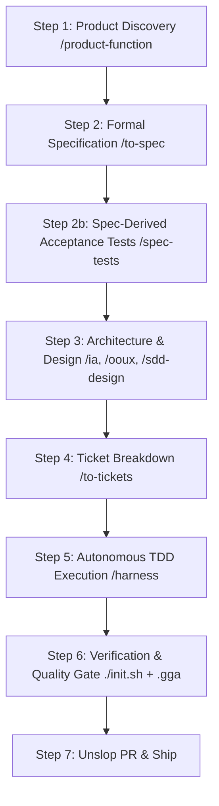

# Architectural Plan: Spec-Derived TDD & Anti-Contamination Test Contracts

This plan addresses the **Tautological Testing** vulnerability in traditional SDD by introducing **Spec-Derived Test Contracts** immediately after `spec.md` and *before* technical design and task decomposition.

---

## User Review Required

> [!IMPORTANT]
> **The Problem: Implementation-Contaminated Testing (Tautological Tests)**
> 
> When tests are written during implementation or derived from `design.md`/`tasks.md`:
> - Tests verify *what the code does*, not *what the business contract requires*.
> - All tests pass (100% Green), yet bugs and missed requirements survive because the test mirrors the developer's/AI's implementation flaws.
> 
> ```text
> ❌ Broken Flow (Contaminated Tests):
> Spec ➔ Design ➔ Tasks ➔ Code ➔ Test (Mirroring Code Flaws = False Green)
> 
> ✅ Spec-Derived TDD Flow (Pure Contract Verification):
> Spec ➔ Behavioral Test Contract (Red) ➔ Design ➔ Tasks ➔ Code (/harness Green ➔ Refactor)
> ```

---

## The Spec-First TDD Architecture



### Key Principles of Spec-Derived Tests

1. **Born from the Spec, Not the Code**: Test cases and acceptance scenarios are generated purely from `spec.md` (Given/When/Then scenarios and domain boundary constraints).
2. **Pre-Design Isolation**: Created before `design.md` to prevent internal technical choices (DB schema, file structures, class names) from polluting the behavioral requirements.
3. **Executable Acceptance Harness**: When `/harness` begins implementing tasks in Step 5, it executes against these pre-committed Red test contracts, ensuring Green only occurs when the actual specification contract is satisfied.

---

## Proposed Changes Across the Repository

### Component 1: Pipeline & SDD Specifications

#### [MODIFY] [`.agents/skills/to-spec/SKILL.md`](file:///Users/cesaradalbertochavezcalderon/Personal/agent-boilerplate/.agents/skills/to-spec/SKILL.md) / [`.agents/skills/autonomic/SKILL.md`](file:///Users/cesaradalbertochavezcalderon/Personal/agent-boilerplate/.agents/skills/autonomic/SKILL.md)
- Ensure every `spec.md` mandatorily outputs a dedicated **Executable Acceptance Criteria / Test Scenario Matrix** before technical design begins.
- Formulate the rule: *Tests must be derived from spec scenarios, never retrofitted to implementation code.*

---

### Component 2: Autonomous Harness Governance

#### [MODIFY] [`.agents/skills/harness/SKILL.md`](file:///Users/cesaradalbertochavezcalderon/Personal/agent-boilerplate/.agents/skills/harness/SKILL.md)
- In the **Red Phase**, mandate that the test written first directly implements one of the pre-defined Spec Acceptance Scenarios from `spec.md`.

---

### Component 3: Global Instructions (`AGENTS.md`)

#### [MODIFY] [AGENTS.md](file:///Users/cesaradalbertochavezcalderon/Personal/agent-boilerplate/AGENTS.md)
- Update Section 2 (Unified Pipeline Mapping Matrix) to include **Step 2b: Spec-Derived Test Contracts**.
- Add the anti-tautology testing rule to Section 6 (GGA Review Rules).

---

## Verification Plan

### Automated Verification
1. **Harness Benchmark**:
   ```bash
   node .agents/skills/harness-creator/scripts/validate-harness.mjs --target .
   ```
   *Expectation: 100/100 score maintained.*

2. **Pre-Commit Audit**:
   ```bash
   gga run --staged
   ```
