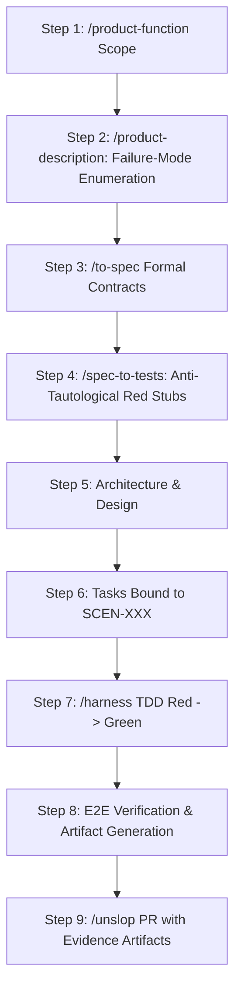

# Implementation Plan: Aligning Testing & Verification Mindset with the Autonomous Pipeline

A concrete architectural mapping showing how the **Anti-Tautology (Test-First)**, **Failure-First Enumeration**, and **E2E Artifact Verification** mindset maps 1:1 into the existing `agent-boilerplate` workflow.

---

## 1. Executive Alignment Summary

This mindset does not replace the existing workflow—**it is the philosophical backbone the workflow was designed to automate**. 

| Proposed Mindset Directive | Existing Pipeline Phase | Concrete Implementation & Artifact |
|---|---|---|
| **1. Failure-First Enumeration** | Step 2: `/product-description`<br>Step 4: `/spec-to-tests` | 5-Family Interrupt Checklist + Negative Invariant Scenarios in `spec-tests.md` |
| **2. Anti-Tautology (Test-First)** | Step 4: `/spec-to-tests`<br>Step 7: `/harness` Red Phase | `spec-tests.md` locked before technical design; tickets strictly bound to `SCEN-XXX` |
| **3. E2E Verifiable Artifacts** | Step 7: `/harness` E2E Pass<br>Step 8: `./init.sh` & Review | Playwright/E2E traces, screenshots, and test receipts logged to `progress.md` |

---

## 2. Step-by-Step Phase Alignment



### Phase A: Failure-First Enumeration (`Step 2 & Step 4`)
- **How it works**: Before code or architecture exists, `/product-description` demands the **5-Family Interrupt Checklist** (User Abort, Mid-Way Navigation, Environment/Network Failure, Target Mutation, Channel Changes).
- **Artifact**: In `/spec-to-tests`, every failure mode becomes an explicit negative scenario ID (`SCEN-002: Rejects expired session token with 401 and zero mutation`).

### Phase B: Anti-Tautology Pre-Design Barrier (`Step 4 & Step 6`)
- **How it works**: `spec-tests.md` is frozen **before** `ia.md`, `ooux.md`, or `tasks.md` are drafted.
- **Enforcement**: In Step 6 (`/to-tickets`), every task ticket must specify which `SCEN-XXX` it satisfies. No ticket can exist without a pre-committed scenario.

### Phase C: Dual-Speed Verification & E2E Artifacts (`Step 7 & Step 8`)
- **Unit / Pure Logic**: Tested in memory in sub-second time during the TDD loop.
- **Complex Features (E2E)**: Complex interactive flows (checkout, authentication, multi-step forms) run via E2E runner (Playwright, Maestro, Cypress).
- **The Artifact Invariant**: The E2E run produces a tangible artifact (e.g. `test-results/trace.zip`, console recordings, or screenshots). The agent captures this proof directly in `progress.md` and embeds it into the PR walkthrough.

---

## 3. Proposed Concrete Additions to `AGENTS.md`

We will codify this mindset at the top of [`AGENTS.md`](file:///Users/cesaradalbertochavezcalderon/Personal/agent-boilerplate/AGENTS.md) (in Section 1 and Section 6):

```markdown
### Testing Directives & Verification Invariants

1. **Anti-Tautology Invariant (Tests Before Code)**:
   - NEVER author tests against already-implemented code.
   - All tests must originate from specification contracts (`spec-tests.md`) before code is written. Tests written after code are tautological and will be rejected.

2. **Failure-First Enumeration**:
   - Before implementing any system or component, FIRST enumerate every way it can fail (network timeouts, corrupt state, invalid inputs, edge boundaries).
   - Write failing assertions (Red Phase) for these failure modes before implementing happy-path logic.

3. **Complex Feature E2E Verification & Artifacts**:
   - Complex workflows, stateful user journeys, and cross-system integrations must be verified via E2E tests.
   - Every E2E test execution MUST produce a verifiable, repeatable artifact (trace, screenshot, or structured JSON summary) recorded in `progress.md` and attached to the PR walkthrough.
```

---

## 4. Verification Plan

- Validate harness score remains 100/100 (`node .agents/skills/harness-creator/scripts/validate-harness.mjs --target .`).
- Check `./init.sh` passes cleanly.
