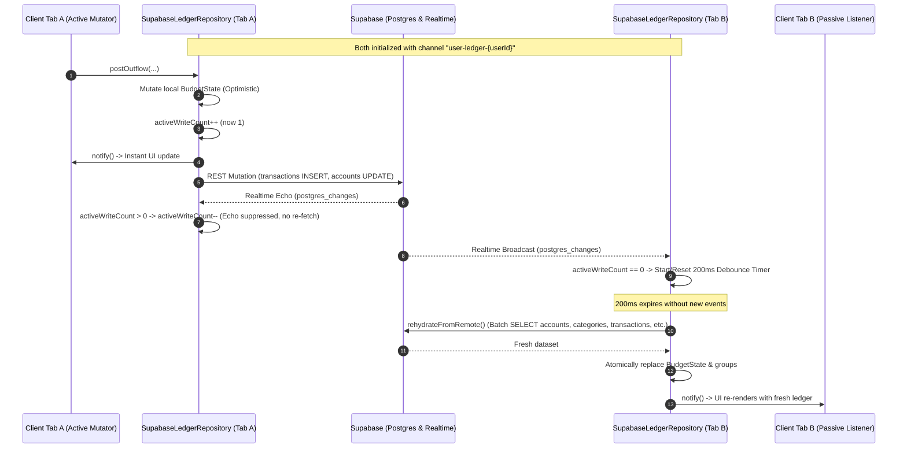

# Implementation Plan - Ticket 04: Coalesced Realtime Synchronization (ALM-028)

- **Change**: `web-supabase-hardening`
- **Ticket ID**: `04`
- **Bound Scenarios**: `SCEN-014`, `SCEN-015`
- **Target Components**:
  - `src/storage/supabase/supabaseLedgerRepository.ts`
  - `src/storage/types.ts`
  - `src/storage/supabase/__tests__/realtimeSync.test.ts`

---

## 1. Problem & Context

In a multi-tab browser environment or across concurrent devices, multiple clients share the same user ledger in Supabase. Realtime synchronization requires subscribing to PostgreSQL changes broadcast over WebSockets.

Two core failure modes must be prevented:
1. **Echo Storms (`SCEN-015`)**: When Client A writes locally, it updates its cache optimistically and issues a REST mutation to Supabase. Supabase then broadcasts the resulting `INSERT`/`UPDATE` event over WebSocket back to Client A. Without echo suppression, Client A would needlessly re-fetch its own changes, calculate redundant diffs, and cause UI flickers.
2. **Event Flooding & Race Conditions (`SCEN-014`)**: Actions like onboarding or month rollover perform multi-table writes in rapid sequence. If every table change event triggers an immediate re-fetch, the client would execute 4-5 redundant batch queries while the database transaction is still settling. A **200ms coalescing debounce** buffers rapid events and executes a single atomic re-hydration.

---

## 2. Architecture & Event Lifecycle



---

## 3. Red-Ready Behavioral Test Contract (`SCEN-014`, `SCEN-015`)

File: `src/storage/supabase/__tests__/realtimeSync.test.ts`

Using Jest fake timers (`jest.useFakeTimers()`), the test suite will verify:

1. **Channel Subscription on Initialization**:
   - `initializeAsync()` invokes `client.channel('user-ledger-<userId>')`.
   - Attaches `.on('postgres_changes', { event: '*', schema: 'public', filter: 'user_id=eq.<userId>' }, callback)`.
   - Calls `.subscribe()`.
2. **Debounced Remote Re-hydration (`SCEN-014`)**:
   - Triggering the realtime callback with `activeWriteCount === 0` starts a 200ms debounce timer.
   - Asserts `client.from(...)` is NOT called at $t = 0\text{ms}$ or $t = 100\text{ms}$.
   - Fast-forwarding timers to $t = 200\text{ms}$ (`jest.advanceTimersByTime(200)`) triggers the batch remote query.
   - Asserts `this.notify()` is called, updating listeners.
3. **Burst Event Coalescing**:
   - Dispatching 5 table change events in rapid succession within 100ms resets the debounce timer each time.
   - Exactly ONE batch query is executed after the final 200ms window expires.
4. **Echo Suppression (`SCEN-015`)**:
   - Performing a local optimistic mutation (`postOutflow`) increments `activeWriteCount`.
   - Simulating the arrival of the echo event decrements `activeWriteCount` and drops the event without scheduling re-hydration.
5. **Error & Rollback Safety**:
   - If a remote write fails (`persistRemote` rejection), `activeWriteCount` is safely decremented to prevent permanently blocking subsequent remote changes.
6. **Channel Disposal**:
   - Calling `dispose()` clears pending debounce timers and calls `client.removeChannel(...)`.

---

## 4. Implementation Details

### Step 1: Interface Update (`src/storage/types.ts`)
Add optional lifecycle method to `LedgerRepository`:
```ts
export interface LedgerRepository {
  // ... existing methods ...
  dispose?(): void;
}
```

### Step 2: Implementation in `SupabaseLedgerRepository` (`src/storage/supabase/supabaseLedgerRepository.ts`)

1. **State Properties**:
   ```ts
   private realtimeChannel: RealtimeChannel | null = null;
   private activeWriteCount = 0;
   private rehydrateDebounceTimer: ReturnType<typeof setTimeout> | null = null;
   ```

2. **Extract Remote Query Helper**:
   Extract dataset fetching and domain mapping from `initializeAsync()` into:
   ```ts
   private async fetchRemoteSnapshot(userId: string): Promise<{
     budgetState: BudgetState;
     groups: CategoryGroup[];
     onboardingCompleted: boolean;
   }>
   ```

3. **Implement Re-hydration**:
   ```ts
   async rehydrateFromRemote(): Promise<void> {
     if (!this.userId) return;
     try {
       const snapshot = await this.fetchRemoteSnapshot(this.userId);
       this.budgetState = snapshot.budgetState;
       this.groups = snapshot.groups;
       this.onboardingCompleted = snapshot.onboardingCompleted;
       this.notify();
     } catch (err) {
       const ledgerErr = new LedgerError(`Realtime re-hydration failed: ${err instanceof Error ? err.message : String(err)}`);
       this.lastSyncError = ledgerErr;
       for (const listener of this.errorListeners) {
         listener(ledgerErr);
       }
     }
   }
   ```

4. **Implement Realtime Event Handler & Debounce**:
   ```ts
   private handleRealtimeEvent(): void {
     if (this.activeWriteCount > 0) {
       this.activeWriteCount--;
       return;
     }

     if (this.rehydrateDebounceTimer) {
       clearTimeout(this.rehydrateDebounceTimer);
     }

     this.rehydrateDebounceTimer = setTimeout(() => {
       this.rehydrateDebounceTimer = null;
       void this.rehydrateFromRemote();
     }, 200);
   }
   ```

5. **Track Optimistic Writes in `executeOptimisticMutation`**:
   ```ts
   this.activeWriteCount++;
   Promise.resolve(persistRemote(this.userId, newState, newGroups ?? this.groups))
     .catch((err) => {
       this.activeWriteCount = Math.max(0, this.activeWriteCount - 1);
       // ... existing rollback logic ...
     });
   ```

6. **Channel Subscription & Clean Teardown**:
   ```ts
   private setupRealtimeSubscription(): void {
     if (!this.userId) return;
     this.teardownRealtimeSubscription();

     this.realtimeChannel = this.client
       .channel(`user-ledger-${this.userId}`)
       .on(
         'postgres_changes',
         { event: '*', schema: 'public', filter: `user_id=eq.${this.userId}` },
         () => this.handleRealtimeEvent()
       )
       .subscribe();
   }

   dispose(): void {
     if (this.rehydrateDebounceTimer) {
       clearTimeout(this.rehydrateDebounceTimer);
       this.rehydrateDebounceTimer = null;
     }
     this.teardownRealtimeSubscription();
     this.listeners.clear();
     this.errorListeners.clear();
   }
   ```

---

## 5. Verification Checklist

- [ ] `src/storage/supabase/__tests__/realtimeSync.test.ts` passes (all assertions green).
- [ ] `./init.sh` executes with 0 TypeScript errors and 100% test pass rate across all suites.
- [ ] Two-Axis Review (`Standards` + `Spec` subagents) passes.
- [ ] Conventional commit and clean squash-merge into `main`.
