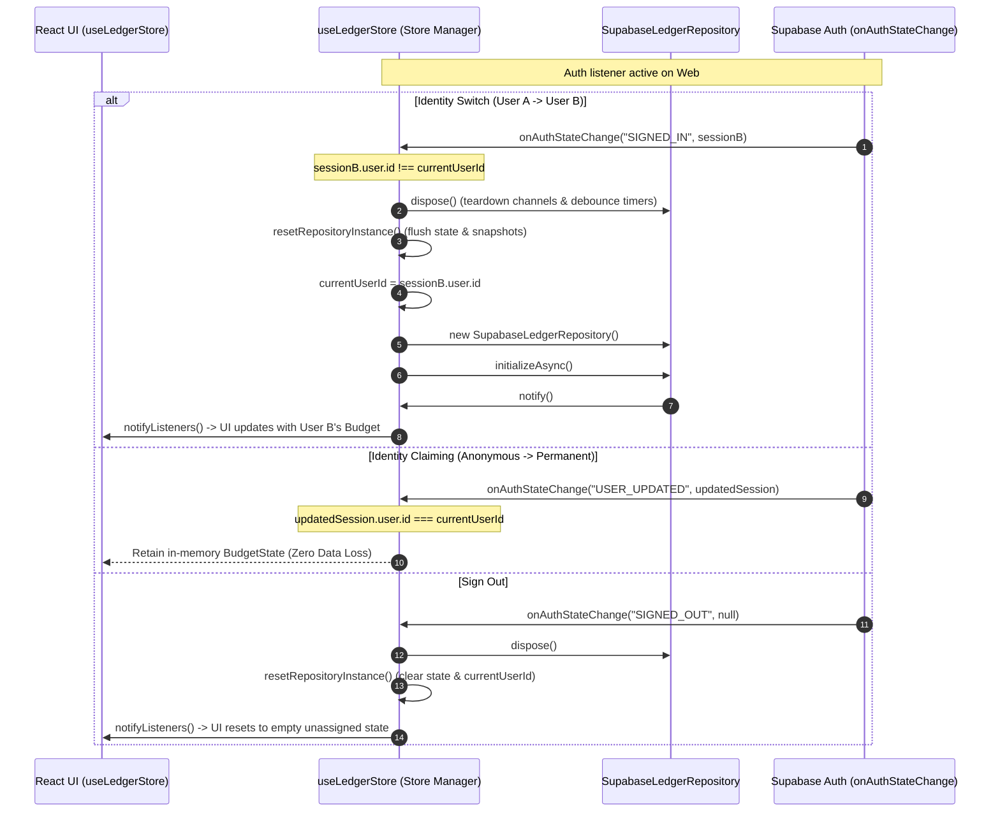

# Implementation Plan - Ticket 05: Auth Lifecycle & Identity Switching (ALM-029)

- **Change**: `web-supabase-hardening`
- **Ticket ID**: `05`
- **Bound Scenarios**: `SCEN-016`, `SCEN-017`
- **Target Components**:
  - `src/storage/supabase/client.ts`
  - `src/storage/useLedgerStore.ts`
  - `src/hooks/useWebBootstrap.ts`
  - `src/storage/supabase/__tests__/authLifecycle.test.ts`

---

## 1. Problem & Context

In a cloud-synchronized web architecture, users can:
1. **Switch Accounts (`SCEN-016`)**: When User A signs out and User B signs in, or when a session expires and another user authenticates, the in-memory `BudgetState` of User A must be immediately flushed to prevent data leakage and cross-account contamination. User B's ledger must then be freshly loaded from Supabase and broadcast to all React components via `useSyncExternalStore`.
2. **Claim Anonymous Accounts (`SCEN-017`)**: New web users begin as anonymous authenticated users. When claiming their account (e.g. adding email/password via `supabase.auth.updateUser` or linking OAuth credentials), Supabase retains the original `user.id` UUID. The client store must recognize that the user identity has not changed, avoiding unnecessary cache wipes or ledger corruption.

---

## 2. Architecture & State Flow



---

## 3. Red-Ready Behavioral Test Contract (`SCEN-016`, `SCEN-017`)

File: `src/storage/supabase/__tests__/authLifecycle.test.ts`

Using Jest and fake timers / shoehorn mocks, the test suite will verify:

1. **`SCEN-016`: Identity Switching & Cache Flushing**:
   - Given an active web session holding Budget A (User A: `$1,500.00` balance).
   - When `onAuthStateChange` triggers with a new session for User B (User B: `$3,200.00` balance).
   - Then:
     - User A's repository instance is disposed (`dispose()` called).
     - In-memory `BudgetState` for User A is purged.
     - Store re-initializes and hydrates User B's data from remote.
     - `useLedgerStore` listeners receive User B's `$3,200.00` budget.
2. **`SCEN-017`: Zero-Data-Loss Identity Claiming**:
   - Given an anonymous user with active accounts, categories, and transactions in the store.
   - When the user claims their account (`USER_UPDATED` or `TOKEN_REFRESHED` with identical `session.user.id`).
   - Then:
     - `useLedgerStore` detects `session.user.id === currentUserId`.
     - In-memory state is preserved without being wiped or re-initialized.
     - All accounts, categories, and transactions remain intact.
3. **Sign Out Lifecycle**:
   - Given an active user session.
   - When `onAuthStateChange` emits `SIGNED_OUT` with `null` session.
   - Then:
     - Repository is disposed.
     - Store resets to empty state and notifies listeners.

---

## 4. Implementation Steps

### Step 1: Auth Listener Hook / Helper (`src/storage/supabase/client.ts`)
- Export `setupAuthListener(callback, client?)`:
  ```ts
  export function setupAuthListener(
    callback: (event: string, session: Session | null) => void,
    client?: SupabaseClient
  ): { unsubscribe: () => void }
  ```

### Step 2: Reactive Auth State Management (`src/storage/useLedgerStore.ts`)
- Track `currentUserId: string | null = null`.
- Add `handleAuthStateChange(event: string, session: Session | null)`:
  - If `session?.user?.id`:
    - If `session.user.id !== currentUserId`:
      - Call `repositoryInstance?.dispose?.()`.
      - Reset `repositoryInstance`, `currentBudgetState`, `currentGroups`, `currentSnapshot`.
      - Update `currentUserId = session.user.id`.
      - Re-initialize new repository instance via `getRepository().initializeAsync?.()`.
      - Notify store listeners via `notifyListeners()`.
  - If `event === 'SIGNED_OUT'` or `!session`:
    - Call `repositoryInstance?.dispose?.()`.
    - Reset `repositoryInstance`, `currentBudgetState`, `currentGroups`, `currentSnapshot`.
    - Update `currentUserId = null`.
    - Notify store listeners.
- Export `initAuthListener(client?: SupabaseClient)` and wire into `resetRepositoryInstanceForTesting()`.

### Step 3: Wire into Web Lifecycle (`src/hooks/useWebBootstrap.ts`)
- Ensure `useWebBootstrap` registers the auth listener on web mount so background identity transitions are handled automatically.

---

## 5. Verification Plan

1. **Unit & Behavioral Tests**:
   - Run `npx jest src/storage/supabase/__tests__/authLifecycle.test.ts`.
   - Confirm all assertions pass for `SCEN-016` and `SCEN-017`.
2. **Full Project Verification**:
   - Run `./init.sh` across all 35 test suites.
   - Confirm 100% test pass rate and 0 TypeScript compilation errors.
3. **Two-Axis Review**:
   - Run `Standards` and `Spec` review subagents.
4. **Pull Request**:
   - Open PR for Ticket 05 (`ALM-029`), watch CI checks, and squash merge into `main`.
