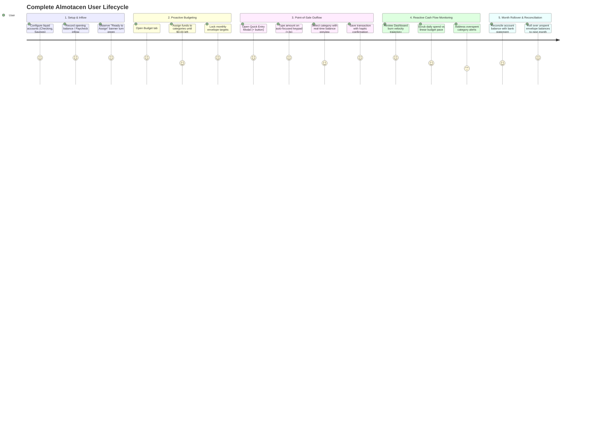

# Implementation Plan: End-to-End User Journey & Comprehensive Task Breakdown

Based on the outside-in product descriptions (`docs/product-description/`), product function ($y = f(x)$), information architecture (`ia.md`), and domain model (`ooux.md`), this plan maps the end-to-end user journey across the complete `almotacen` product and breaks down the implementation into testable, atomic engineering tasks.

---

## 1. End-to-End Product User Journey

### Journey Step Details

1. **Step 1: First-Run Onboarding & Dual Ledger Initialization**
   - User creates liquid accounts (`Primary Checking`, `Emergency Savings`, `Credit Card`).
   - Entering opening balances establishes liquid spending power.
   - Dual ledger formula validates: $\sum \text{Liquid Accounts} = \text{Ready to Assign}$.

2. **Step 2: Proactive Envelope Allocation (Payday Workflow)**
   - User navigates to `/(tabs)/budget`.
   - Top banner shows `Ready to Assign: $X,XXX.XX`.
   - User assigns dollars into Envelope Groups (`Immediate Obligations`, `True Expenses`, `Quality of Life`).
   - Reaching `$0.00` turns the banner neutral gray: *"All Money Assigned"*.

3. **Step 3: Point-of-Sale Outflow Capture (< 3 Seconds)**
   - User taps persistent floating `+` button (`/modal`).
   - Keypad focuses immediately; user inputs `$14.50`, taps payee/category.
   - Envelope preview highlights remaining balance change in real-time.
   - Tap "Save Transaction": instant local dual commit (Account decrements, Envelope decrements, Cash Flow updates).

4. **Step 4: Reactive Trajectory Monitoring (Monarch-Style)**
   - User visits `/(tabs)/index`.
   - Titanium Hero Card shows net monthly cash flow and burn percentage.
   - Interactive Burn Trajectory Chart plots cumulative spend against linear budget pace with horizontal scrubbing.

5. **Step 5: Account Reconciliation & Month Rollover**
   - User verifies cleared account balances in `/(tabs)/accounts`.
   - At month-end, positive envelope balances roll over; negative balances are settled against next month's `Ready to Assign`.

---

## 2. Comprehensive Task Breakdown

### Phase 1: Local-First State Store & SQLite Ledger Persistence
- [ ] **TASK-001**: Implement SQLite schema migration (`accounts`, `categories`, `category_groups`, `transactions`, `budget_months`).
- [ ] **TASK-002**: Connect `src/domain/ledger/ledgerEngine.ts` to reactive React context/hooks (`useLedgerStore`).
- [ ] **TASK-003**: Seed initial default category groups and accounts for instant first-run experience.
- [ ] **TASK-004**: Unit & integration test SQLite persistence for atomic dual-entry consistency.

### Phase 2: Point-of-Sale Quick Entry (<3s Mobile Flow)
- [ ] **TASK-005**: Wire `/modal.tsx` to `postOutflowTransaction` and `postInflowTransaction`.
- [ ] **TASK-006**: Implement real-time envelope balance preview on category selection (`$45.00 ➔ $30.50`).
- [ ] **TASK-007**: Add haptic feedback and debounce protection (closing `BT-001` in `bug-triage.md`).
- [ ] **TASK-008**: Test keyboard dismiss, drag-to-dismiss, and form state recovery on app backgrounding.

### Phase 3: Proactive Zero-Based Budgeting Screen
- [ ] **TASK-009**: Connect `/(tabs)/budget.tsx` to live `readyToAssignCents` state.
- [ ] **TASK-010**: Implement interactive category allocation slider & quick-pill stepper (+$50, +$100, Fill Remaining).
- [ ] **TASK-011**: Build overspent / overassigned alert states with visual color cues (green/amber/red).
- [ ] **TASK-012**: Implement month rollover logic (carryover positive balances, deduct overspending).

### Phase 4: Reactive Cash Flow & Burn Velocity Chart
- [ ] **TASK-013**: Build cumulative daily spend aggregator from transaction history.
- [ ] **TASK-014**: Implement interactive touch scrubber on Cash Flow chart with day-by-day tooltip HUD and micro-haptics.
- [ ] **TASK-015**: Connect Dashboard Titanium Hero Card metrics to live ledger totals (Net Cash Flow, Burn Velocity %).

### Phase 5: Accounts Management & Reconciliation
- [ ] **TASK-016**: Wire `/(tabs)/accounts.tsx` to live account balances and transaction histories.
- [ ] **TASK-017**: Implement account creation and balance adjustment / reconciliation flow.
- [ ] **TASK-018**: Add transaction filtering and search across payees and categories.

### Phase 6: Sync Queue & Offline-First Hardening
- [ ] **TASK-019**: Implement sync status queue (`pending` vs `synced`) for transactions.
- [ ] **TASK-020**: Full end-to-end verification pass against `docs/product-description/verification/`.

---

## 3. Verification & Acceptance Criteria
- Every task begins with a failing unit/component test (Red ➔ Green).
- Zero lint/typecheck errors (`npx tsc --noEmit`).
- Verification checklists in `docs/product-description/verification/` pass completely.
