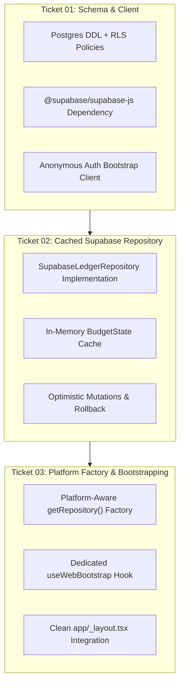

# Implementation Plan: Web Supabase Integration (Phase 1)

## Executive Summary
This implementation plan establishes Phase 1 of Almotacen's hybrid local-first architecture. It connects web clients directly to Supabase Postgres via an optimistic in-memory caching repository implementing `LedgerRepository`, while preserving embedded SQLite for native mobile offline operations.

---

## 1. Scope & Deliverables

---

## 2. Work Breakdown & Ticket Sequencing

### [Ticket 01: Supabase Schema & Anonymous Client](file:///Users/cesaradalbertochavezcalderon/orca/workspaces/almotacen/oystercatcher/openspec/changes/web-supabase-integration/tickets/01-supabase-schema-and-client.md)
- **Goal**: Author Postgres DDL migration and configure Supabase client with anonymous authentication.
- **Bound Scenarios**: `SCEN-001`, `SCEN-002`, `SCEN-003`.
- **Files**:
  - `package.json`: Add `@supabase/supabase-js`.
  - `supabase/migrations/20260925_init_ledger_schema.sql`: Postgres DDL mirroring SQLite v2 schema (`metadata`, `accounts`, `category_groups`, `categories`, `transactions`) with `user_id uuid references auth.users(id)` and strict RLS policies (`auth.uid() = user_id`).
  - `src/storage/supabase/client.ts`: Singleton client reading `EXPO_PUBLIC_SUPABASE_URL` and `EXPO_PUBLIC_SUPABASE_ANON_KEY`, with `ensureAnonymousSession()`.
  - `src/storage/supabase/__tests__/client.test.ts`: Unit tests verifying client configuration and session creation.

### [Ticket 02: Cached Supabase Ledger Repository](file:///Users/cesaradalbertochavezcalderon/orca/workspaces/almotacen/oystercatcher/openspec/changes/web-supabase-integration/tickets/02-cached-supabase-ledger-repository.md)
- **Goal**: Implement `SupabaseLedgerRepository` satisfying the `LedgerRepository` contract with an in-memory cache and optimistic mutations.
- **Bound Scenarios**: `SCEN-004`, `SCEN-005`, `SCEN-006`, `SCEN-007`.
- **Files**:
  - `src/storage/supabase/supabaseLedgerRepository.ts`: Implements `LedgerRepository`. Synchronous getters (`getBudgetState`, `getCategoryGroups`) read from local cache; mutations apply domain transformations locally, notify listeners, and fire background Postgres writes with rollback on error.
  - `src/storage/supabase/mappers.ts`: Type-safe mappers between Postgres rows and domain entities.
  - `src/storage/supabase/__tests__/supabaseLedgerRepository.test.ts`: Test suite testing cache hydration, optimistic state updates, and rollback invariants against a mocked Supabase client.

### [Ticket 03: Platform Factory & Web Bootstrapping](file:///Users/cesaradalbertochavezcalderon/orca/workspaces/almotacen/oystercatcher/openspec/changes/web-supabase-integration/tickets/03-platform-factory-and-web-bootstrapping.md)
- **Goal**: Wire the repository factory to route by platform and add clean web bootstrap orchestration.
- **Bound Scenarios**: `SCEN-008`.
- **Files**:
  - `src/hooks/useWebBootstrap.ts`: Dedicated hook managing async anonymous auth and repository hydration.
  - `src/storage/useLedgerStore.ts`: Platform routing returning `SupabaseLedgerRepository` on web and `SQLiteLedgerRepository` on native.
  - `app/_layout.tsx`: Await `useWebBootstrap` on web before hiding the splash screen.
  - `src/storage/__tests__/platformFactory.test.ts`: Unit tests for factory resolution.

---

## 3. Verification & Definition of Done
1. **Automated Suite**: `./init.sh` executes with 0 failures across all unit/integration tests and static typechecking.
2. **Local Web Execution**: `npx expo start --web` launches on `http://localhost:8081` with clean UI render and no console errors.
3. **Multi-Tenancy Security**: RLS policies verified to isolate user data.
