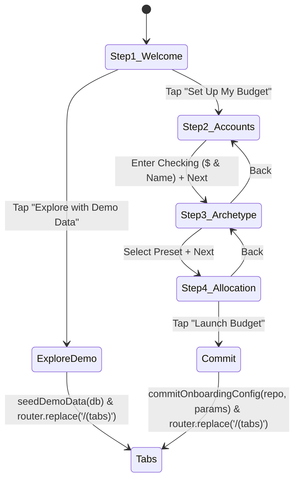

# Implementation Plan: ALM-013 Ticket 04 — Interactive Multi-Step Onboarding UI Wizard

**Feature Reference**: `ALM-013` (User Onboarding Wizard)  
**Ticket**: 04 (Interactive Multi-Step Onboarding UI Wizard)  
**Bound Scenarios**: `SCEN-052`, `SCEN-053`, `SCEN-054`  
**Target Branch**: `feature/CCH/ALM-013-user-onboarding-wizard`  

---

## 1. Executive Summary & Objective

Ticket 04 builds the user-facing mobile onboarding flow for Almotacen, replacing the placeholder screen in [`app/onboarding.tsx`](file:///Users/cesaradalbertochavezcalderon/orca/workspaces/almotacen/oystercatcher/app/onboarding.tsx).

The wizard guides first-time users through a 4-step wizard or provides an instant 1-tap "Explore with Demo Data" shortcut:
1. **Step 1 — Welcome & Mode Choice**: Hero greeting with "Set Up My Budget" primary CTA and "Explore with Demo Data" secondary CTA (`SCEN-052`).
2. **Step 2 — Account Setup**: Primary checking account name (default: "Primary Checking") and starting cash balance; optional credit card toggle with card name and starting debt (`SCEN-053`).
3. **Step 3 — Financial Archetype Selection**: Interactive selection among 4 curated presets (`STANDARD_BALANCED`, `DEBT_SNOWBALL`, `FREELANCER_VARIABLE`, `MINIMALIST_LIVING`) with live envelope previews and description badges (`SCEN-053`).
4. **Step 4 — Review & Zero-Based Allocation**: Live calculation of starting funds distributed to archetype envelopes, real-time "Ready to Assign" balance preview, and final "Launch Budget" commit CTA executing transactional database persistence (`SCEN-054`).

---

## 2. Architecture & Container-Presentational Design

To uphold GGA Section 6 architecture standards:
- **Container (`app/onboarding.tsx` / `OnboardingScreen`)**:
  - Manages wizard state: active step index (1..4), depository account form, credit card account form, selected archetype ID, and calculated allocations.
  - Interacts with storage: instantiates `createOnboardingRepository(db)` and imports `seedDemoData(db)` from `src/storage/schema`.
  - Handles navigation: `router.replace('/(tabs)')` upon successful initialization.
- **Presentational (`src/components/onboarding/OnboardingWizardView.tsx`)**:
  - Pure visual renderer consuming typed props: current step, step change handlers, form states, error messages, and submission triggers.
  - Step views:
    - `WelcomeStepView`: Greeting, benefit bullet points, primary/secondary CTAs.
    - `AccountsStepView`: Checking inputs (name, balance formatted as currency), Credit card toggle with debt inputs, validation feedback.
    - `ArchetypeStepView`: 4 card selectors highlighting preset targets and group structure.
    - `AllocationReviewStepView`: Summary card displaying Starting Balance, Total Assigned to Envelopes, Ready to Assign leftover, and the "Launch Budget" button.
- **Design Tokens & Accessibility**:
  - Uses `src/theme` (`colors`, `spacing`, `typography`, `shadows`).
  - Reuses design system primitives (`Button`, `Card`).
  - Accessible touch targets (>= 44pt), explicit `accessibilityRole` and `accessibilityLabel` attributes on all interactive controls.

---

## 3. Detailed Step Specifications & User Invariants

### Step 1: Welcome & Mode Choice (`SCEN-052`)
- **Title**: "Welcome to Almotacen"
- **Subtitle**: "Dual-ledger cash flow and proactive envelope budgeting designed for financial clarity."
- **Primary CTA**: "Start Guided Setup" ➔ transitions to Step 2.
- **Secondary CTA**: "Explore with Demo Data" ➔ invokes `seedDemoData(db)`, confirms `isOnboardingCompleted(db) === true`, and executes `router.replace('/(tabs)')`.

### Step 2: Account Setup (`SCEN-053`)
- **Checking Account Form**:
  - Account Name input (defaults to "Primary Checking").
  - Starting Balance input (entered in decimal dollars, converted cleanly to integer cents via `dollarsToCents`).
  - Validation: Name cannot be empty; balance must be non-negative (`>= 0`).
- **Credit Card Toggle**:
  - Switch: "I also have a credit card with an existing balance".
  - If enabled:
    - Card Name input (defaults to "Credit Card").
    - Current Statement Debt input (converted to integer cents).
- **Navigation Controls**: "Back" (to Step 1) and "Continue to Archetypes" (disabled if checking balance is invalid).

### Step 3: Financial Archetype Selection (`SCEN-053`)
- Preset selection grid:
  1. `STANDARD_BALANCED` ("Standard Balanced" — Rent, Groceries, Utilities, Savings).
  2. `DEBT_SNOWBALL` ("Debt Crusher" — Aggressive debt repayment, minimal discretionary).
  3. `FREELANCER_VARIABLE` ("Freelancer & Variable" — Buffer runway, quarterly taxes, irregular income).
  4. `MINIMALIST_LIVING` ("Minimalist" — Core essentials and single discretionary bucket).
- Selecting a preset updates the active template state and renders an expandable category preview.
- **Navigation Controls**: "Back" (to Step 2) and "Review Allocations" (to Step 4).

### Step 4: Allocation Review & Launch (`SCEN-054`)
- Automatically computes initial allocations via `calculateInitialAllocation(checkingBalanceCents, template.categories)`.
- Displays balance reconciliation:
  - Total Starting Cash: `$X,XXX.XX`
  - Total Assigned to Envelopes: `$Y,YYY.YY`
  - Leftover Ready to Assign: `$Z,ZZZ.ZZ` ($X - $Y)
- Breakdown of envelopes that will be funded immediately on Day 1.
- **CTA**: "Launch Budget" ➔ calls `commitOnboardingConfig(repo, params)`, triggers success haptic, and redirects to `/(tabs)`.

---

## 4. Test Strategy (TDD Red ➔ Green)

We will author comprehensive component and integration tests in `src/screens/__tests__/OnboardingScreen.test.tsx`:
1. **Demo Seeder Flow (`SCEN-052`)**:
   - Renders Step 1.
   - Taps "Explore with Demo Data".
   - Asserts `seedDemoData` was called on the database and navigation called `router.replace('/(tabs)')`.
2. **Full Guided Wizard Flow (`SCEN-053`, `SCEN-054`)**:
   - Steps through 1 ➔ 2 (fills Checking: "Main Checking", Balance: "$2,000.00").
   - Advances to Step 3 (selects `STANDARD_BALANCED`).
   - Advances to Step 4 (verifies Ready to Assign preview and allocation amounts).
   - Taps "Launch Budget".
   - Verifies `accounts`, `categories`, `category_groups`, and `metadata.onboarding_completed` in SQLite.
   - Verifies router navigated to `/(tabs)`.
3. **Credit Card Debt & Unfunded Reserve Flow**:
   - In Step 2, enables credit card toggle, inputs "Apple Card", debt "$500.00".
   - Verifies created credit account with `-50000` balance and payment envelope with `50000` unfunded debt.
4. **Validation & Edge Cases**:
   - Disables submission if account name is empty or balance is invalid.

---

## 5. Verification Checklist

- [ ] `src/components/onboarding/OnboardingWizardView.tsx` created with Container-Presentational separation.
- [ ] `app/onboarding.tsx` wired with wizard state machine, database adapter, and router.
- [ ] `src/screens/__tests__/OnboardingScreen.test.tsx` passes with 100% test coverage for wizard flows.
- [ ] Zero TypeScript errors (`npm run typecheck`).
- [ ] Automated `./init.sh` green pass across all test suites.
- [ ] Automated `.gga` pre-commit audit pass.
