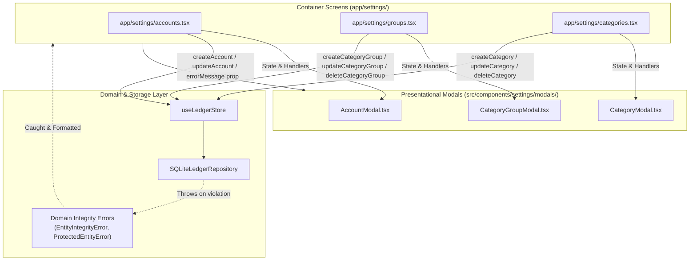

# Implementation Plan: Ticket 04 — Entity Management Modals & Confirmation Alerts

## Executive Summary
This plan details the implementation for **Ticket 04** (`openspec/changes/settings-entity-management-data-reset/tickets/04-entity-management-modals.md`) bound to scenarios `SCEN-002`, `SCEN-004`, `SCEN-007`, `SCEN-008`, `SCEN-011`, and `SCEN-012`.

We will introduce reusable, accessible modal sheets for creating, editing, and deleting Accounts, Category Groups, and Envelope Categories. These modals maintain a strict container-presentational separation, utilize currency parsing/formatting helpers in integer cents, display domain integrity error banners, and trigger native two-step confirmation alerts before performing irreversible destructive operations.

---

## 1. Architectural Design & Boundaries

### 1.1 Seam Architecture


### 1.2 Separation of Concerns
1. **Presentational Modals (`src/components/settings/modals/`)**:
   - Pure stateless/local-form UI components wrapped in React Native `Modal`.
   - Maintain form input state (text inputs, pickers/segments) and inline validation.
   - Emit `onSave(formData)`, `onDelete(id)`, and `onClose()`.
   - Render error banners when `errorMessage` is passed from parent.
   - Zero store subscriptions or router dependencies.
2. **Container Screens (`app/settings/`)**:
   - Manage modal visibility (`isModalVisible`) and active entity (`editingEntity | null`).
   - Catch domain integrity errors (`EntityIntegrityError`, `ProtectedEntityError`) and set contextual error messages.
   - Orchestrate native `Alert.alert` confirmation dialogs for deletion.
   - Call atomic CRUD actions from `useLedgerStore`.

---

## 2. Component Specifications

### 2.1 `AccountModal` (`src/components/settings/modals/AccountModal.tsx`)
- **Mode**: Create (`initialAccount == null`) or Edit (`initialAccount != null`).
- **Fields**:
  - `Name`: String input, trimmed, required.
  - `Account Type`: Segmented control (`checking` | `savings` | `credit`). Read-only in edit mode to preserve credit payment invariant.
  - `Balance`: Currency input using `formatCentsToCurrency` / `parseCurrencyToCents`. In create mode: initial starting balance. In edit mode: balance adjustment.
- **Actions**:
  - `Cancel` / Close button.
  - `Save` / `Create Account` (primary action).
  - `Delete Account` (destructive button, edit mode only).
- **Validation**:
  - Non-empty name.
  - Valid integer cents.
  - On delete: triggers confirmation alert; catches transaction constraint errors.

### 2.2 `CategoryGroupModal` (`src/components/settings/modals/CategoryGroupModal.tsx`)
- **Mode**: Create or Edit/Rename.
- **Fields**:
  - `Name`: String input, trimmed, required.
- **Actions**:
  - `Cancel` / Close button.
  - `Save` / `Create Group`.
  - `Delete Group` (destructive button, edit mode only).
- **Validation**:
  - Non-empty name.
  - On delete: triggers confirmation alert; catches non-empty category child guard.

### 2.3 `CategoryModal` (`src/components/settings/modals/CategoryModal.tsx`)
- **Mode**: Create or Edit.
- **Fields**:
  - `Name`: String input, trimmed, required.
  - `Group`: Picker selecting target `groupId` from available `groups`.
  - `Target Amount`: Optional currency input (integer cents).
  - `Target Type`: Picker (`need` | `target_balance` | `debt_payoff`).
  - `Target Due Day`: Optional numeric input (1..31).
- **Actions**:
  - `Cancel` / Close button.
  - `Save` / `Create Category`.
  - `Delete Category` (destructive button, edit mode only).
- **Validation**:
  - Non-empty name.
  - Non-credit payment category guard (`isCreditPayment === true` cannot be edited or deleted directly).
  - On delete: catches non-zero available cents or active transactions.

---

## 3. Destructive Alert Flow & Error Handling

### 3.1 Two-Step Confirmation Prompts
```typescript
// Example Deletion Flow in Container
function promptDeleteEntity(
  title: string,
  message: string,
  onConfirm: () => void
): void {
  Alert.alert(title, message, [
    { text: 'Cancel', style: 'cancel' },
    { text: 'Delete', style: 'destructive', onPress: onConfirm },
  ]);
}
```

### 3.2 Error Banner Surfacing
- If the repository throws `EntityIntegrityError` or `ProtectedEntityError`:
  - Account with active transactions: *"Cannot delete account with existing transactions. Transfer or delete transactions first."*
  - Category group with child envelopes: *"Cannot delete category group containing categories. Reassign or delete categories first."*
  - Category with positive funds or transactions: *"Cannot delete category with available funds or active transactions. Move funds to Ready to Assign first."*
  - Credit payment category: *"Credit card payment categories are automatically managed and cannot be deleted directly."*
- Errors are displayed in an accessible red callout banner inside the modal, without dismissing or losing user input.

---

## 4. File Structure & Changes

| File | Purpose |
|---|---|
| `src/components/settings/modals/AccountModal.tsx` | Presentational modal sheet for Account create/edit/delete |
| `src/components/settings/modals/CategoryGroupModal.tsx` | Presentational modal sheet for Category Group create/rename/delete |
| `src/components/settings/modals/CategoryModal.tsx` | Presentational modal sheet for Category create/edit/delete |
| `src/components/settings/modals/index.ts` | Barrel export for settings modals |
| `src/components/settings/modals/FormErrorBanner.tsx` | Reusable error alert banner component for modals |
| `app/settings/accounts.tsx` | Wire `AccountModal`, handle create/update/delete with alerts & error states |
| `app/settings/groups.tsx` | Wire `CategoryGroupModal`, handle create/update/delete with alerts & error states |
| `app/settings/categories.tsx` | Wire `CategoryModal`, handle create/update/delete with alerts & error states |
| `app/settings/__tests__/entityModals.test.tsx` | Comprehensive component & behavioral integration test suite |

---

## 5. Verification Plan

### 5.1 Automated Behavioral Test Suite (`app/settings/__tests__/entityModals.test.tsx`)
1. **Account Modal Flow**:
   - `SCEN-002`: Submitting valid Depository account calls `createAccount` and credits Ready to Assign.
   - `SCEN-004`: Submitting updated name/balance updates the account.
   - `SCEN-005`: Deleting account with transactions surfaces error banner and preserves account.
   - `SCEN-006`: Deleting clean account removes record.
2. **Category Group Modal Flow**:
   - `SCEN-007`: Submitting new group calls `createCategoryGroup`.
   - `SCEN-008`: Renaming group updates name.
   - `SCEN-009`: Deleting group with child categories surfaces error banner.
   - `SCEN-010`: Deleting empty group removes record.
3. **Category Modal Flow**:
   - `SCEN-011`: Submitting new category under group inserts record with target parameters.
   - `SCEN-012`: Submitting updated category updates fields.
   - `SCEN-013`: Deleting credit payment category is blocked.
   - `SCEN-014`: Deleting category with available funds surfaces error banner.
   - `SCEN-015`: Deleting clean category removes record.

### 5.2 Verification Gates
1. `npm run typecheck` (`tsc --noEmit`): 0 errors.
2. `npm test` (`jest`): 100% test pass rate across all suites.
3. `./init.sh`: Clean pass with no failures.
4. `.gga` Pre-commit AI code review: strict compliance with clean architecture and type safety.
