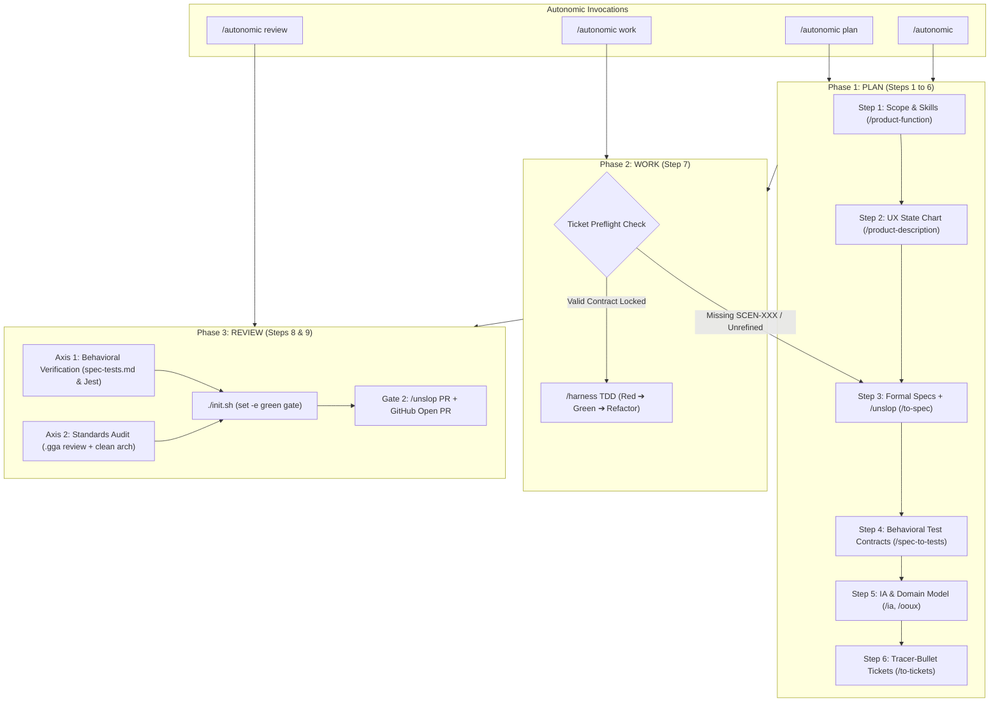

# Implementation Plan: Refactor `/autonomic` to 3-Phase Architecture (`plan`, `work`, `review`)

Refactor the `/autonomic` master orchestrator into three callable subcommand phases (`/autonomic plan`, `/autonomic work`, `/autonomic review`), while preserving `/autonomic <idea>` as the full autonomous end-to-end runner. Update both the current repository and the upstream `agent-boilerplate` template.

---

## User Review Required

> [!IMPORTANT]
> This change introduces explicit subcommand routing for `/autonomic`:
> - `/autonomic` (or `/autonomic all`): Executes the entire pipeline end-to-end (`Plan` ➔ `Work` ➔ `Review`).
> - `/autonomic plan <idea>`: Executes Steps 1 through 6 (Scope, UX State Chart, Formal Specs, Test Contracts, IA/OOUX, Ticket Slicing).
> - `/autonomic work <ticket>`: Executes Step 7 with a mandatory **Ticket Preflight Check** (verifying `SCEN-XXX` binding and input/output contracts) before running `/harness` TDD Red ➔ Green ➔ Refactor.
> - `/autonomic review`: Executes Step 8 & 9 with a **Two-Axis Review** (Axis 1: Behavioral Verification against `spec-tests.md`, Axis 2: Standards & Code Quality via `.gga`) ➔ Gate 2 `/unslop` PR.

---

## Architecture Design

---

## Proposed Changes

### 1. Skill Definition: `oystercatcher/.agents/skills/autonomic/SKILL.md`
- Restructure CLI invocation grammar:
  - `/autonomic <idea>` (Autonomous Full Pipeline)
  - `/autonomic plan [idea]` (Executes Steps 1 to 6)
  - `/autonomic work [ticket]` (Executes Ticket Preflight + Step 7 `/harness` TDD)
  - `/autonomic review [branch]` (Executes Two-Axis Review + Gate 2 PR)
- Add **Ticket Preflight Protocol** in Phase 2 (`work`):
  - Invariant: A ticket cannot be coded until it has bound `SCEN-XXX` acceptance criteria from `spec-tests.md`. If unrefined, routes automatically back to Step 3/4.
- Add **Two-Axis Review Protocol** in Phase 3 (`review`):
  - Axis 1: Spec Contract Audit (Anti-Tautological verification against `spec-tests.md`).
  - Axis 2: Standards & Code Quality Audit (`.gga` pre-commit rules, strict typing, clean architecture seams).

### 2. Workspace Governance: `oystercatcher/AGENTS.md`
- Update Section 2 ("Unified SDD & 7-Step Architecture Pipeline"):
  - Document the 3 macro subcommands (`/autonomic plan`, `/autonomic work`, `/autonomic review`).
  - Update the Unified Pipeline Mapping Matrix to clearly reflect the 3 macro phases and the two-axis review gate.

### 3. Upstream Boilerplate: `agent-boilerplate`
- Synchronize `.agents/skills/autonomic/SKILL.md` and `AGENTS.md`.
