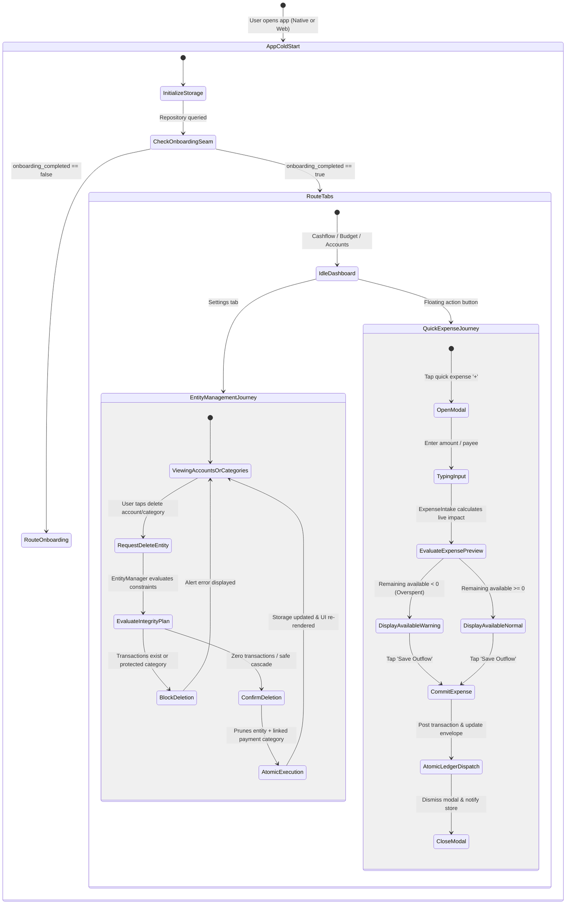

# Behavioral UX State Chart & Interrupt Checklist: Architecture Deepening

Outside-in behavioral state model for core interactive workflows across the deepened architecture: Entity Management, Point-of-Sale Quick Expense Capture, and Onboarding Bootstrapping.

---

## 1. Outside-In User Journey: Entity Management, Point-of-Sale Intake & App Bootstrapping

---

## 2. Five-Family Interrupt Checklist

| Interrupt Family | Scenario | Deepened System Behavior & Invariant Safeguard |
|---|---|---|
| **1. Abort / User Exit** | User cancels Account Deletion confirmation or closes Quick Expense modal mid-typing. | Modal dismisses instantly; no partial or orphaned state is posted to `EntityManager` or `ExpenseIntake`; ledger balances remain untouched. |
| **2. Mid-way Distraction** | User enters amount and payee, then background switches apps at point of sale before saving. | Form state persists in-memory; upon foreground return, live overspending evaluation and suggested categories re-evaluate against current budget state without crash. |
| **3. Clean Complete** | User logs an expense or deletes an unused checking account. | `ExpenseIntake` or `EntityManager` executes an atomic mutation; storage commits in a single transaction; UI subscribers update synchronously via `useSyncExternalStore`. |
| **4. Network / Platform Boundary** | User triggers entity deletion on Web while offline. | The atomic mutation plan is verified locally first; optimistic cache updates immediately; background Supabase transaction retries or triggers standard rollback on network failure. |
| **5. Referential Integrity Violation** | User attempts to delete a credit card account that still has active transactions or a linked payment category with balance. | `EntityManager` blocks the mutation at the domain seam before any SQL statement executes; presents clear contextual error message to user. |
