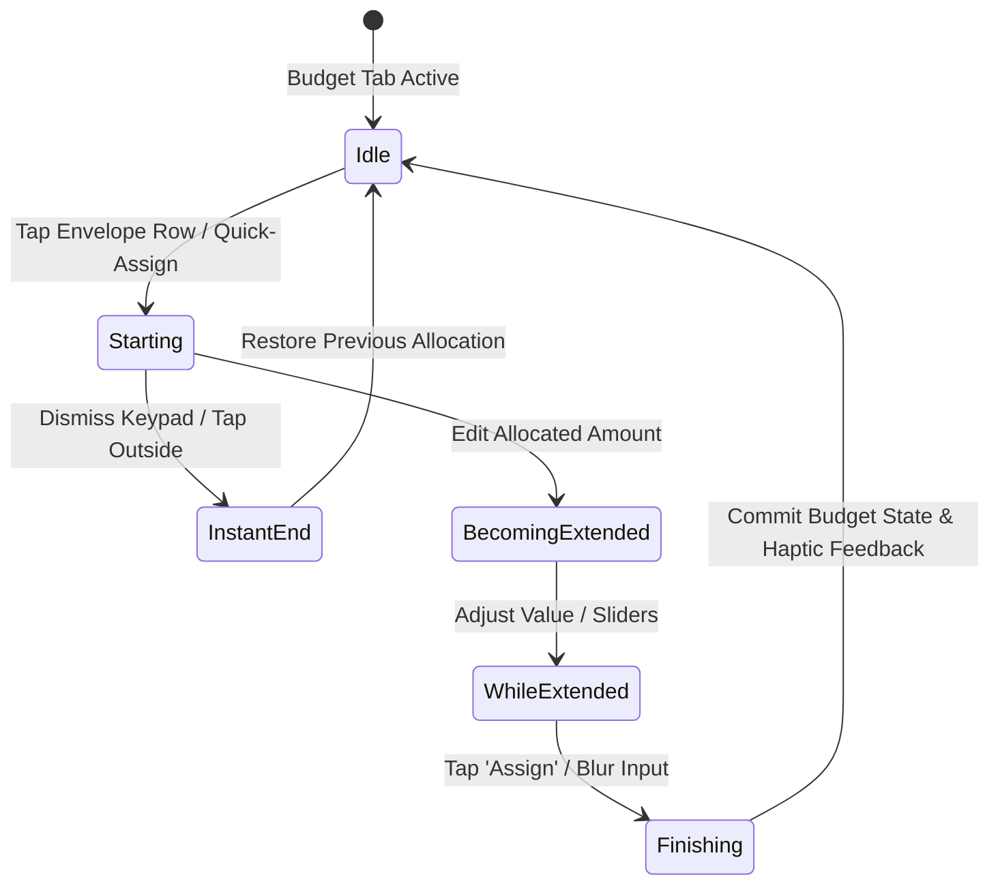

# Feature: Zero-Based Envelope Allocation

## 1. Summary
The user allocates liquid cash from the "Ready to Assign" pool into individual spending and savings envelopes until unassigned funds reach zero. The interface provides interactive sliders, quick-fill buttons, and real-time validation to ensure every dollar is given a specific job before money is spent.

## 2. The Simple Case
The user navigates to the Budget tab. A prominent header banner displays `Ready to Assign: $1,200.00` in soft green. The user taps the "Groceries" envelope row, enters `$400.00` via the numeric pad, and taps "Assign". The banner immediately decrements to `Ready to Assign: $800.00`, and the Groceries envelope progress bar fills proportionally. The user repeats this for remaining categories until the banner turns neutral gray and displays `All Money Assigned ($0.00)`.

## 3. The Interaction, Event by Event

- **Starting**: User taps an envelope row or the "Auto-Assign" header CTA. The category allocation drawer slides up or inline input activates with current allocated amount highlighted.
- **Instant End**: User taps away or swipes down without altering the figure. The input dismisses; no funds are moved.
- **Becoming Extended**: User types a new value or drags the allocation slider. The "Ready to Assign" balance updates in live preview text directly above the input.
- **While Extended**: As values change, if the entered allocation exceeds available "Ready to Assign", the banner changes to caution red (`Overassigned by $X.XX`) and a contextual suggestion ("Cover with unassigned funds or move from another envelope") appears.
- **Finishing**: User taps "Assign" or commits the input. A subtle haptic confirmation triggers, the envelope's available balance is recalculated, and the new monthly allocation target is persisted.

## 4. Modifiers
| Modifier | At Start | During Interaction |
|---|---|---|
| Auto-Assign Preset (Underfunded, Average, Reset) | Populates default target values based on historical pace | Switches allocation mode for all categories at once |
| Currency Quick-Pills (+$50, +$100, Fill Remaining) | Unassigned pool shown as single-tap quick pills | Automatically calculates and inserts exact remaining balance |

## 5. Cancel and Interrupt (The 5 Families)
1. **Family 1: Explicit Abort**: Tapping "Cancel" or pressing hardware back discards uncommitted draft numbers and restores previous allocation amounts.
2. **Family 2: User Distraction / Mid-Way Action**: Switching to the Accounts tab or locking the device preserves the current draft input locally; returning immediately restores the open drawer.
3. **Family 3: Clean Complete Events**: Tapping the checkmark button or pressing "Done" on the keyboard commits the envelope assignment immediately.
4. **Family 4: Environment & Network Failures**: Offline mode stores allocation records locally in SQLite; UI operates with zero latency or network blocks.
5. **Family 5: Target Mutation**: If an automatic bank transaction imports in the background and alters liquid cash, the "Ready to Assign" banner recalculates dynamically while maintaining user-entered drafts.

## 6. Interactions with Other Systems
- **Ready to Assign Pool**: Decrements or increments dollar-for-dollar with category assignments.
- **Cash Flow Projections**: Adjusts projected end-of-month runway based on allocated targets.
- **Envelope Cards**: Visual progress rings and progress bars update their fill percentage in real-time.
- **Local Database & Cloud Sync**: Commits transaction batch to local SQLite ledger and enqueues background sync.

## 7. Edge Cases
- Allocating more than "Ready to Assign": Allowed, but triggers a red banner warning indicating the budget is overassigned.
- Negative Allocation (Unassigning funds): Decreases envelope balance and returns money back to "Ready to Assign".
- Month Rollover: Unspent positive balances roll over into the next month's available envelope amount; negative balances reset against the new month's Ready to Assign.

## 8. Open Questions & Verification
- Pinned source commit: `2fde8e8`.
- Multi-currency envelope allocation parity verified against native locale formatting.
