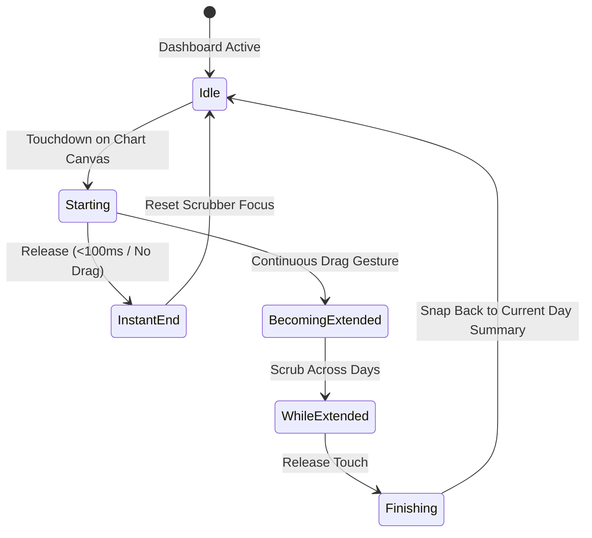

# Feature: Reactive Cash Flow & Burn Velocity Chart

## 1. Summary
The user inspects their monthly financial trajectory through an interactive, reactive cash flow burn chart. The chart visualizes historical cumulative outflows against expected monthly income benchmarks, computing daily burn velocity to provide instant clarity on whether current spending pace will exceed available cash.

## 2. The Simple Case
From the Dashboard / Cash Flow tab, the user views the main Cash Flow card. A curved trajectory line traces actual daily cumulative spending from day 1 through today. A dashed benchmark line represents the linear budget pace. The user scrubs across the graph with a thumb drag: a vertical tracker line follows the touch, rendering a floating tooltip displaying the specific date, cumulative outflow to that day, and pace delta (`-$120.00 ahead of pace`). Tapping off returns to the default monthly summary.

## 3. The Interaction, Event by Event

- **Starting**: User touches the chart surface. The nearest data point lights up with a subtle radial pulse.
- **Instant End**: Quick tap without dragging focuses that day for 2 seconds before smoothly resetting to the current day.
- **Becoming Extended**: Continuous pan gesture locks vertical chart tracking. Screen scroll is locked to prevent erratic vertical jumping.
- **While Extended**: As thumb moves horizontally, the floating HUD updates in real-time with micro-haptic clicks on calendar day boundaries. Outflow breakdown for that selected day is dynamically summarized below the chart.
- **Finishing**: Finger lifts from screen. Scrub overlay fades out over 200ms; main metrics smoothly animate back to the current month-to-date summary.

## 4. Modifiers
| Modifier | At Start | During Interaction |
|---|---|---|
| Month Selector (Prev / Next Month) | Displays current month by default | Animates full chart curve transition with slide left/right |
| Granularity Toggle (Daily Burn vs Cumulative Outflow) | Defaults to Cumulative Trajectory | Switches visual representation from continuous area fill to discrete daily bar spikes |

## 5. Cancel and Interrupt (The 5 Families)
1. **Family 1: Explicit Abort**: Swiping beyond the horizontal chart boundaries cancels scrubbing and releases scroll lock back to the parent container.
2. **Family 2: User Distraction / Mid-Way Action**: Tapping a transaction in the list below while scrubbing immediately cancels chart interaction and opens transaction details.
3. **Family 3: Clean Complete Events**: Double-tapping the chart resets zoom and scrubber position to the present calendar day.
4. **Family 4: Environment & Network Failures**: Offline mode computes all trajectories from local SQLite ledger cache; chart renders without skeleton loaders or delay.
5. **Family 5: Target Mutation**: If a new expense is logged or synced in real-time, the curve animates upward optimistically and recalculates burn velocity.

## 6. Interactions with Other Systems
- **Transaction Ledger**: Feeds raw dated transaction amounts into the chart computation aggregator.
- **Budget Envelopes**: Informs the benchmark target threshold based on total planned monthly allocations.
- **Account Balances**: Drives the upper liquid ceiling line on the cash flow projection canvas.

## 7. Edge Cases
- First day of the month: Renders single anchor point with dashed linear projection for remaining days.
- Inflow spikes exceeding outflows: Net cash flow trajectory indicates positive surplus with distinctive green accent.
- Irregular months (Leap year, 28/30/31 days): X-axis scales dynamically according to actual calendar month days.

## 8. Open Questions & Verification
- Pinned source commit: `2fde8e8`.
- 60fps/120fps gesture scrubbing responsiveness verified on iOS ProMotion and Android 120Hz displays.
