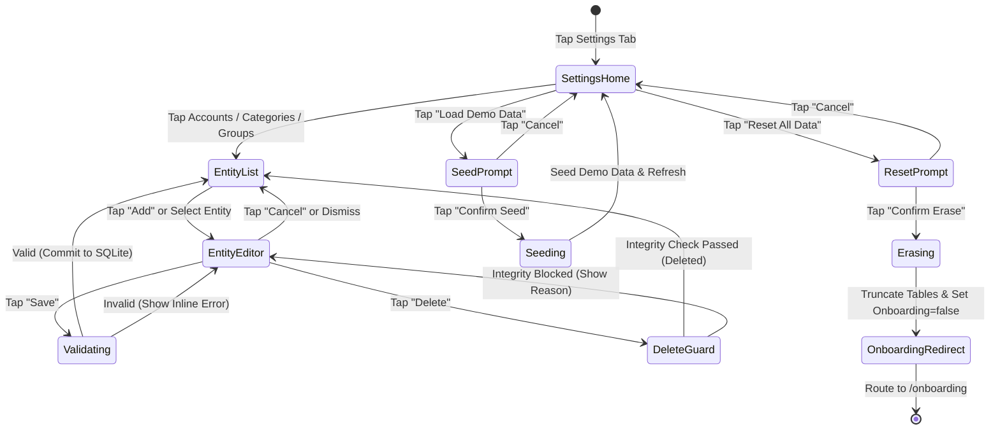

# Feature Description: Settings, Entity Management & Data Reset

## 1. Summary

The Settings screen provides users with administrative management over their financial domain entities (Accounts, Category Groups, Categories) and lifecycle storage states (Factory Data Reset and Demo Data Seeding). The user accesses Settings through a dedicated fourth tab in the primary tab bar. From this screen, the user can inspect database statistics, tap into entity management sub-views to create or edit accounts and categories, or execute guarded data management operations. Destructive operations (deleting an entity or wiping database records) require positive confirmation and assert strict referential integrity constraints before committing to storage.

---

## 2. The Simple Case

1. The user taps the **Settings** tab in the main tab bar.
2. The screen displays a grouped inset list with three sections:
   - **Entities**: "Accounts", "Category Groups", "Categories" (each navigating to dedicated sub-screens).
   - **Data Management**: "Clear Transactions Only (Re-Anchor)", "Load Demo Data", "Reset All Data (Factory Reset)".
   - **Diagnostics**: "Database Version", "Account Count", "Category Count", "Transaction Count".
3. To add an account:
   - User taps "Accounts" to push to the Accounts management sub-screen, and taps "+ Add Account".
   - A modal sheet opens; user types "High Yield Savings", selects type "Checking/Savings", inputs "$1,000.00", and taps "Save".
   - The account list updates immediately; navigating back to the "Accounts" tab shows the new account and updated total net balance.
4. To reset data:
   - User taps "Reset All Data (Factory Reset)".
   - An alert dialog warns: *"This will permanently erase all accounts, categories, and transactions. This action cannot be undone."*
   - User taps "Erase Everything".
   - The database is cleared, and the application immediately transitions to the `/onboarding` screen.
5. To clear transactions only:
   - User taps "Clear Transactions Only (Re-Anchor)".
   - An alert dialog warns: *"This will delete all transaction records and zero out envelope spending. Account balances are preserved as your new baseline."*
   - User confirms. Transactions are wiped, envelopes reset to $0.00, and Ready to Assign is recalculated to equal total liquid cash.

---

## 3. The Interaction, Event by Event

### Starting
- **Entity Creation / Edit**: User taps an entity row or "+ Add" button. The system opens an edit sheet pre-populated with default empty values (for Add) or existing entity attributes (for Edit).
- **Data Reset**: User taps "Reset All Data". The system presents a destructive confirmation alert dialog.

### Instant End
- User taps "Cancel" or closes the modal sheet by swiping down without changing fields. The sheet dismisses without writing to SQLite.
- User taps "Cancel" on the Reset alert. The alert dismisses with zero state changes.

### Becoming Extended
- In the entity editor, user modifies fields (e.g. typing a name, toggling account type, entering target cents). Form validation runs synchronously:
  - Account name cannot be empty.
  - Category must have a valid parent Category Group selected.
  - Numerical inputs must format to valid non-negative integer cents.
- The "Save" button remains disabled or rejects submission until validation passes.

### While Extended
- For deletion requests:
  - If user taps "Delete Entity", the system synchronously inspects referential integrity:
    - *Account*: Checks for linked transactions in `transactions`. If found, displays error: *"Cannot delete account with existing transactions."*
    - *Category Group*: Checks for child categories in `categories`. If found, displays error: *"Cannot delete group containing categories. Move or delete categories first."*
    - *Category*: Checks for assigned transactions in `transactions` or non-zero `available_cents`. If found, displays error: *"Cannot delete category with active transactions or assigned funds."*
    - *Credit Card Payment Category*: If category has `is_credit_payment = 1`, deletion is blocked: *"Credit payment categories are automatically managed with credit accounts."*

### Finishing
- On valid "Save": An atomic SQLite transaction writes the insert/update, syncs ledger cache, and dismisses the sheet.
- On confirmed "Factory Reset": An atomic SQLite transaction deletes rows from `transactions`, `categories`, `category_groups`, and `accounts`, sets `onboarding_completed = 'false'` and `ready_to_assign_cents = '0'`, and invokes navigation redirect to `/onboarding`.

### State Diagram

---

## 4. Modifiers

| Trigger / Context | State at Start | Behavior During Interaction |
|---|---|---|
| Entity Mode: Create vs Edit | Create mode has empty inputs and "Add" header; Edit mode pre-fills existing entity values and displays "Delete" action. | Switching fields maintains local state until Save or Cancel. |
| Account Type: Credit vs Depository | Depository creates a standard balance account; Credit card automatically provisions a linked `cat-cc-payment` category in Credit Card Payments group. | Changing account type on an existing account is disabled once transactions exist. |
| Factory Reset vs Demo Seed | Factory Reset wipes data and unsets onboarding flag; Demo Seed replaces existing data with canonical seed archetype and keeps onboarding completed. | Both display destructive/warning action sheet confirmation before executing. |

---

## 5. Cancel and Interrupt (The 5 Families)

### Family 1: Explicit Abort
- Tapping "Cancel" in the header of the entity editor dismisses the sheet without saving changes.
- Tapping "Cancel" on any confirmation alert (reset, seed, delete) immediately closes the modal with zero mutations.

### Family 2: User Distraction / Mid-Way Action
- Switching tabs while inside Settings retains Settings root state.
- If a modal sheet is open and user receives a system push or navigates to background, local uncommitted form state is retained in React state until explicitly dismissed or app is terminated.

### Family 3: Clean Complete Events
- Submitting an entity save commits to SQLite synchronously in a single transaction, updates the shared in-memory ledger store, and dismisses the sheet.
- Factory reset executes synchronously, invalidates in-memory store, updates metadata `onboarding_completed = 'false'`, and invokes `router.replace('/onboarding')`.

### Family 4: Environment & Network Failures
- The application operates 100% local-first via SQLite. No network connection is required; offline state has zero impact on settings or entity management.
- App crashes or unexpected termination during modal editing results in zero changes (uncommitted form state is discarded; database remains untouched).

### Family 5: Target Mutation & Channel Changes
- If an entity was updated in the background or during month rollover, the editor reads fresh records from SQLite before rendering.

---

## 6. Interactions with Other Systems

- **Route Guard (`app/_layout.tsx`)**:
  - The root layout monitors `isOnboardingCompleted`. When Factory Reset sets `onboarding_completed` to `false`, the guard reacts immediately and redirects the view hierarchy to `/onboarding`.
- **Primary Tabs (`Cash Flow`, `Budget`, `Accounts`)**:
  - Entity mutations immediately reflect across tabs:
    - New/edited accounts appear in `accounts.tsx`.
    - New/edited category groups and categories appear in `budget.tsx`.
    - Deleting an entity cleans up associated allocations and updates `ready_to_assign_cents`.
- **Quick Capture Modal (`app/modal.tsx`)**:
  - Pickers for Accounts and Categories populate dynamically from the updated SQLite entity tables.

---

## 7. Edge Cases

1. **Attempting to Delete an Account with Linked Transactions**:
   - Deletion is rejected. User must delete or reassign transactions before removing the account.
2. **Attempting to Delete a Category with Non-Zero Balance**:
   - Deletion is rejected. User must reallocate remaining funds to $0.00 first, preserving zero-based budget invariants.
3. **Attempting to Delete the Default Credit Card Payment Category**:
   - System flags category as protected (`is_credit_payment = 1`). It can only be removed by deleting the parent credit card account.
4. **Deleting a Category Group with Child Categories**:
   - Deletion is rejected. Child categories must be moved to another group or deleted first.

---

## 8. Open Questions & Verification

- **Source Commit**: Pinned to current working tree (`bugfix/CCH/ALM-014-onboarding-safe-area`).
- **Verification Strategy**:
  - Unit tests covering `LedgerRepository` entity management methods (`createAccount`, `updateAccount`, `deleteAccount`, `createCategoryGroup`, etc.).
  - Component tests verifying Settings screen rendering, modal opening, form validation, and reset confirmation flow.
