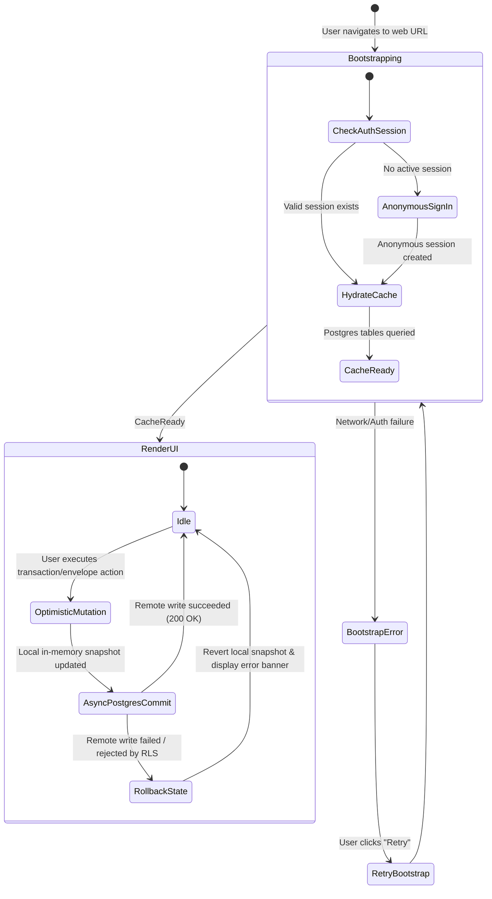

# Product Description: Web Supabase Integration (Phase 1)

## 1. System Overview
This document specifies the outside-in user experience and state machine for Almotacen running on the web, backed by Supabase cloud storage.

---

## 2. Interaction State Chart

---

## 3. Five-Family Interrupt Checklist

| Family | Interrupt Condition | System Response |
|---|---|---|
| **Network Loss** | Web user goes offline during active session | In-memory cache allows continued viewing; writes queue or show clear "Offline: unable to sync" banner with rollback. |
| **Auth Expiry** | Anonymous session token expires or is cleared | Supabase auto-refreshes JWT; if refresh fails, prompts transparent session re-creation. |
| **RLS Violation** | Attempt to read or write rows belonging to another user | Query returns 0 rows or empty result set; mutation rejects with permission error without corrupting local state. |
| **Concurrent Edit** | Multiple tabs open under same user session | Local mutations update remote Postgres; subsequent navigation refreshes snapshot. |
| **Schema Mismatch** | Web client accesses outdated Postgres schema | Clear typed `DatabaseInitializationError` with diagnostic banner. |
