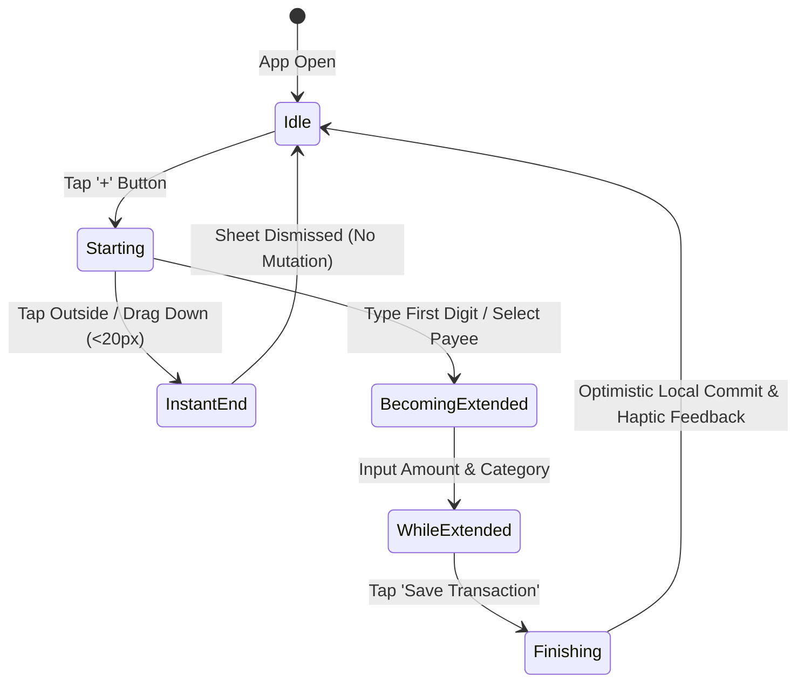

# Feature: Point-of-Sale Quick Expense Entry

## 1. Summary
The user quickly logs an outflow expense at the point of sale. The interface provides a native bottom sheet with immediate keypad focus, smart category suggestion based on the payee name, and real-time preview of the impacted envelope balance.

## 2. The Simple Case
From any screen, the user taps the persistent `+` action button. A native bottom sheet slides up with the numerical keypad active. The user types `14.50`, taps the "Coffee Shop" payee, selects "Dining Out", and taps "Done". The sheet dismisses with a soft haptic vibration. The Dining Out envelope decreases by $14.50, and the Cash Flow burn chart increments immediately.

## 3. The Interaction, Event by Event

- **Starting**: User taps the `+` Floating Action Button or modal trigger. The sheet animates upward; numeric keypad focuses immediately. Account defaults to last used account.
- **Instant End**: User immediately drags down or taps the scrim without typing. Sheet dismisses; zero mutations recorded.
- **Becoming Extended**: User types the first number or chooses a payee. Clear button appears; save action becomes enabled.
- **While Extended**: As amount is typed, the target category card shows dynamic feedback: e.g. "Dining Out: $45.00 ➔ $30.50". If amount exceeds category balance, the envelope badge pulses amber with a warning: "Overspent by $X".
- **Finishing**: User taps "Save Transaction". Sheet dismisses with light haptic tick. Ledger account balance updates, category available amount decreases, and cash flow chart repaints optimistically.

## 4. Modifiers
| Modifier | At Start | During Interaction |
|---|---|---|
| Split Category Toggle | Off (Single Category) | Expands split allocator rows to divide total amount across envelopes |
| Inflow / Outflow Switch | Defaults to Outflow (Expense) | Toggling to Inflow changes category selector to "Ready to Assign" or Income Category |

## 5. Cancel and Interrupt (The 5 Families)
1. **Family 1: Explicit Abort**: Tapping "Cancel" or swiping down the sheet closes the modal immediately, discarding uncommitted form state.
2. **Family 2: User Distraction / Mid-Way Action**: App backgrounded or phone call received while typing. Form draft persists in temporary memory; returns to exact state on foreground resume.
3. **Family 3: Clean Complete Events**: Tapping keyboard "Done" or primary action button commits transaction and cleans draft state.
4. **Family 4: Environment & Network Failures**: Device is offline. Transaction is written to local SQLite database with `sync_status = pending`; user sees instant UI update without spinners or error modals.
5. **Family 5: Target Mutation**: If a category was deleted on another synced device while this entry is open, saving re-routes the expense to an "Uncategorized" envelope with a prompt to reassign.

## 6. Interactions with Other Systems
- **Cash Flow Dashboard**: Outflow total increases; daily burn velocity updates.
- **Budget Envelopes**: Remaining category balance decrements immediately.
- **Account Ledger**: Account balance decrements.
- **Offline / Sync Engine**: Enqueues sync mutation for background push to Supabase.

## 7. Edge Cases
- Entering $0.00: Save button remains disabled.
- Negative amounts: Handled via the Inflow/Outflow toggle rather than negative key entries.
- Category with $0.00 balance: Permitted, but envelope balance reflects negative balance requiring budget reallocation.

## 8. Open Questions & Verification
- Pinned commit: `HEAD`.
- Haptic feedback availability verified across native iOS and Android.
