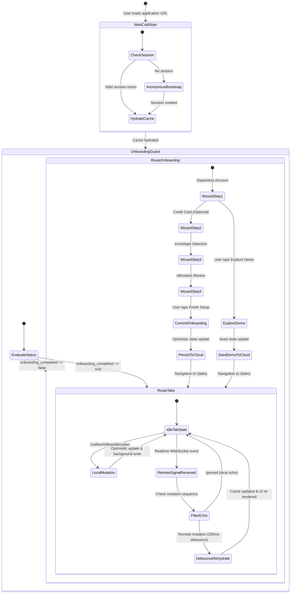

# Behavioral UX State Chart & Interrupt Checklist: Web Supabase Experience

## 1. Outside-In User Journey: Web Launch, Onboarding & Realtime Sync

---

## 2. Five-Family Interrupt Checklist

| Interrupt Family | Scenario | System Behavior & Mitigation |
|---|---|---|
| **1. Abort / User Exit** | User closes browser tab mid-wizard (e.g. at Step 3). | In-flight form state is discarded; anonymous session remains valid in localStorage; on revisit, user lands back on Step 1 of onboarding with zero corrupt database rows. |
| **2. Mid-way Distraction** | User switches browser tabs while remote sync is active. | WebSocket connection maintains subscription; incoming changes coalesce into a single background re-hydration; when user refocuses tab, UI reflects latest data with zero stutter. |
| **3. Clean Complete** | User completes wizard or clicks "Explore Demo". | Ledger repository commits accounts, envelopes, and metadata atomically; local cache immediately updates; user transitions seamlessly to `/(tabs)`; background write confirms in Supabase. |
| **4. Network / Environment Drop** | User loses internet connection during web onboarding or transaction logging. | Optimistic mutations notify local listeners immediately; background HTTP write retries or rolls back with an error banner; user is warned before state divergence occurs. |
| **5. Channel / Identity Change** | User logs into an existing account while in an anonymous session. | `onAuthStateChange` listener intercepts event, flushes old anonymous in-memory cache, and re-hydrates the incoming user's cloud ledger cleanly. |
