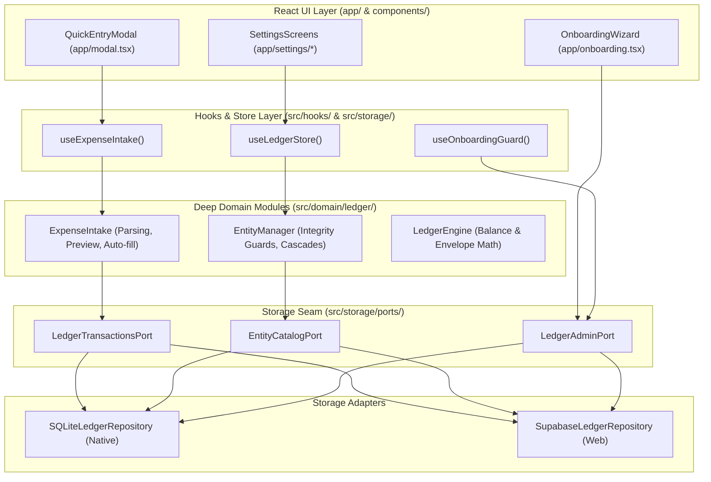

# Information Architecture: Architecture Deepening (`ia_architecture_deepening.md`)

Structural and contextual information architecture for deepened codebase modules and seams.

---

## 1. System Module Hierarchy & Seam Boundaries

```text
src/
├── domain/                                # Core Domain Business Rules (Zero I/O, Pure)
│   ├── ledger/
│   │   ├── entityManager.ts               # [DEEPENED] Unified entity lifecycle & integrity engine
│   │   ├── ledgerEngine.ts                # Pure transaction mutation math
│   │   ├── autoAssign.ts                  # Auto-assign payday allocation
│   │   ├── overspendingCoverage.ts        # Interactive overspending rebalancing
│   │   ├── rollover.ts                    # Month rollover calculations
│   │   └── expenseIntake.ts               # [NEW/DEEPENED] POS expense parsing & deficit preview
│   └── onboarding/
│       ├── onboardingService.ts           # Onboarding validation & archetype resolution
│       └── archetypes.ts                  # Starter budget templates
├── storage/                               # Storage Ports & Adapters (Pluggable Seam)
│   ├── ports/                             # [DEEPENED] Segregated storage interfaces
│   │   ├── ledgerTransactionsPort.ts      # Transaction posting & budget queries
│   │   ├── entityCatalogPort.ts           # Account, category, and group management
│   │   └── ledgerAdminPort.ts             # Diagnostics, resets, and onboarding commit
│   ├── ledgerRepository.ts                # SQLite adapter (native)
│   ├── supabase/
│   │   └── supabaseLedgerRepository.ts    # Supabase adapter (web)
│   ├── database.ts                        # Native SQLite driver factory
│   └── useLedgerStore.ts                  # React sync external store adapter
└── hooks/                                 # UI Adapters (React Integration)
    ├── useExpenseIntake.ts                # [NEW/DEEPENED] Lightweight hook for quick POS capture
    ├── useOnboardingGuard.ts              # [CLEANED] Decoupled onboarding status checker
    └── useSettings.ts                     # Presentational settings action handlers
```

---

## 2. Information Flow Across Seams


