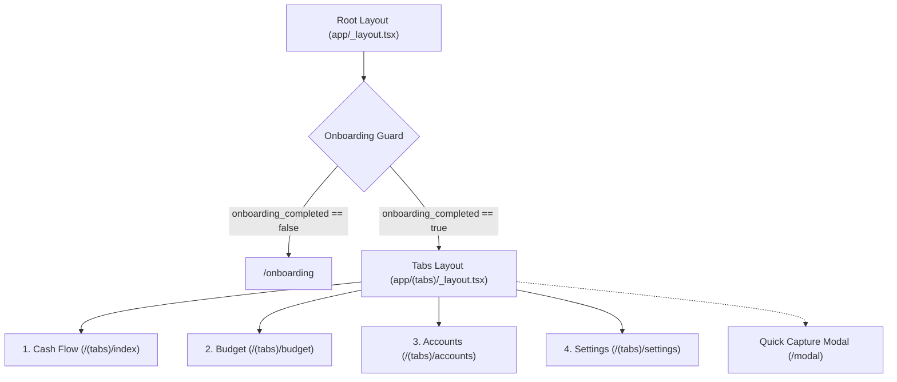

# Information Architecture: Settings & Entity Management

## 1. Global Navigation Hierarchy

The application navigation architecture integrates `Settings` as a first-class persistent bottom navigation destination:



---

## 2. Settings Screen Layout Architecture

The Settings screen utilizes iOS Grouped Inset List patterns divided into three primary functional domains:

```text
┌──────────────────────────────────────────────────────────┐
│  Settings                                                │
│                                                          │
│  ENTITIES                                                │
│  ┌────────────────────────────────────────────────────┐  │
│  │ 💳  Accounts                              (2)   ❯  │  │
│  │ 📁  Category Groups                       (4)   ❯  │  │
│  │ 🏷️   Categories                           (6)   ❯  │  │
│  └────────────────────────────────────────────────────┘  │
│                                                          │
│  DATA MANAGEMENT                                         │
│  ┌────────────────────────────────────────────────────┐  │
│  │ 🧹  Clear Transactions Only (Re-Anchor)         ❯  │  │
│  │ 🔄  Load Demo Starter Data                      ❯  │  │
│  │ ⚠️  Reset All Data (Factory Reset)              ❯  │  │
│  └────────────────────────────────────────────────────┘  │
│                                                          │
│  DIAGNOSTICS & SYSTEM                                    │
│  ┌────────────────────────────────────────────────────┐  │
│  │ Schema Version                                 v2  │  │
│  │ Total Transactions                              0  │  │
│  │ Database Driver                     SQLite (local) │  │
│  └────────────────────────────────────────────────────┘  │
└──────────────────────────────────────────────────────────┘
```

---

## 3. Key User Journeys

### Journey 1: Managing Financial Accounts
1. User taps `Settings` ➔ taps `Accounts`.
2. A bottom sheet or list renders active accounts with their current balances.
3. User taps "+ Add Account" to open the creation sheet.
4. User selects account type (`Checking`, `Savings`, `Credit Card`), inputs name and initial balance.
5. On save, new account is persisted, `ready_to_assign_cents` is credited for depository accounts, or linked CC payment category is created.
6. The account is immediately visible in `Accounts` tab and `Settings`.

### Journey 2: Category & Group Restructuring
1. User taps `Settings` ➔ taps `Category Groups` or `Categories`.
2. User can add new groups (e.g. "Subscriptions") or new categories with targets.
3. User can edit group names, adjust category target types (`NEEDED_FOR_SPENDING`, `MONTHLY_SET_ASIDE`, `DEBT_PAYMENT`), target due days, or delete empty entities.

### Journey 3: Atomic Data Reset / Factory Reset
1. User taps `Reset All Data (Factory Reset)`.
2. A native double-confirmation alert opens explaining that all accounts, envelopes, and transactions will be erased.
3. User selects destructive action "Erase All Data".
4. Database tables are purged, metadata reset (`onboarding_completed = false`), and `useOnboardingGuard` immediately routes the user to `/onboarding`.
