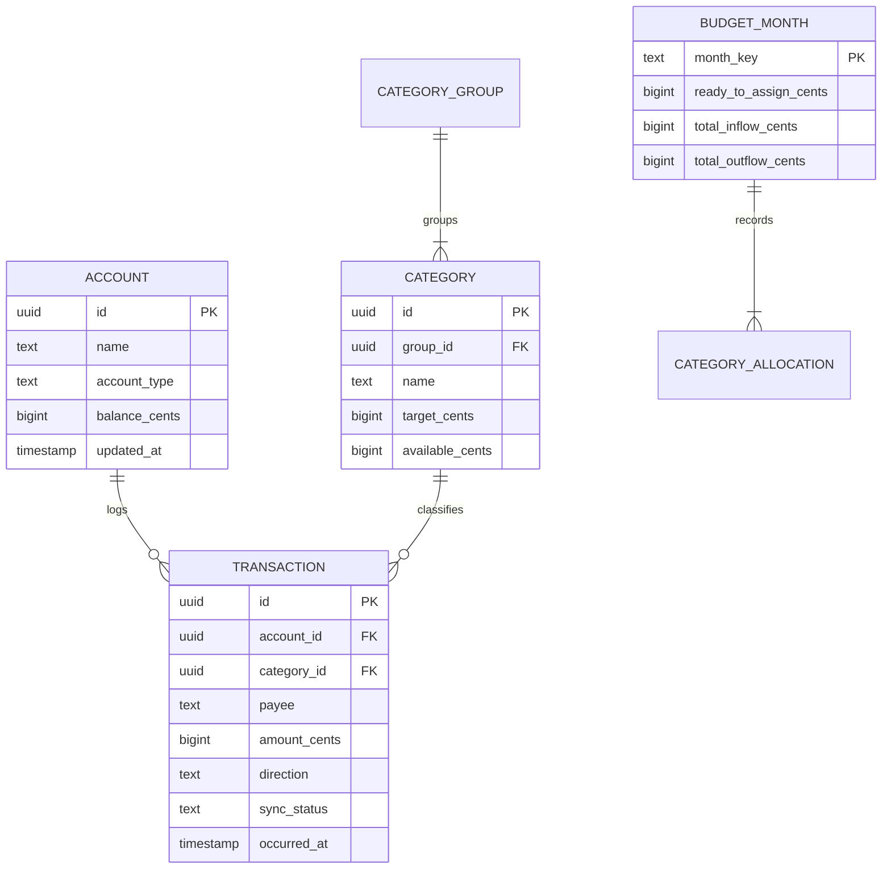

# Object-Oriented User Experience (OOUX) & Domain Model

## 1. Core Domain Objects

### Object 1: `Account`
- **Core Content**: Name, Type (`checking` | `savings` | `credit` | `cash`), Current Balance.
- **Metadata**: Created at, last reconciled at, currency.
- **Relationships**: Has many `Transactions`.

### Object 2: `Category` (Envelope)
- **Core Content**: Name, Assigned Amount, Activity (Outflows), Available Balance.
- **Metadata**: Target monthly goal, color/icon, sort order.
- **Relationships**: Belongs to `CategoryGroup`, has many `Transactions`.

### Object 3: `Transaction`
- **Core Content**: Amount (in integer cents to avoid floating point drift), Date, Payee, Direction (`inflow` | `outflow`).
- **Metadata**: Notes, Cleared status, `sync_status` (`synced` | `pending`).
- **Relationships**: Belongs to `Account`, optionally belongs to `Category` (if outflow).

### Object 4: `BudgetMonth`
- **Core Content**: Month Identifier (e.g. `2026-09`), `ready_to_assign` balance, Total Inflow, Total Outflow.
- **Relationships**: Encompasses Category Allocations for that calendar cycle.

---

## 2. Entity Relationship Diagram (ERD)

