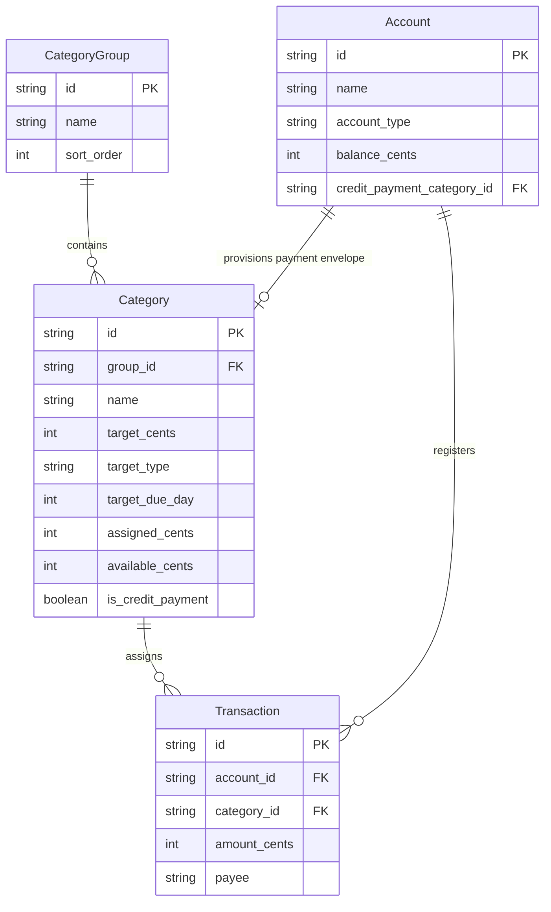

# Object-Oriented UX (OOUX): Settings & Entity Management

## 1. System Object Overview

Settings and administrative controls manage four core domain objects and two operational service objects:
- **Account**: Financial repository holding liquid assets or debt.
- **CategoryGroup**: Organizational grouping container for budget envelopes.
- **Category**: Actionable envelope with spending targets and assigned balances.
- **DataResetAction**: Sovereign administrative trigger modifying storage lifecycle.
- **SystemDiagnostics**: Read-only representation of database storage and schema health.

---

## 2. Noun Extraction & Filtering Matrix

| Candidate Noun | OOUX Classification | Decision | Rationale |
|---|---|---|---|
| **Account** | Core Entity | Include | Real-world depository or credit account. |
| **Category Group** | Core Entity | Include | Primary grouping structure for budget organization. |
| **Category** | Core Entity | Include | Core zero-based envelope entity. |
| **Factory Reset** | Operational Action | Include | Destructive state transition object triggering `/onboarding`. |
| **Demo Seeding** | Operational Action | Include | Pre-packaged archetype provisioning action. |
| **Database Diagnostics** | Derived State | Include | Read-only reflection of SQLite schema and row counts. |
| *Settings Menu* | Container / View | Exclude as object | Map as navigation list view for child entities. |
| *Confirmation Dialog* | UI Mechanism | Exclude as object | Presentational modal guard for destructive actions. |

---

## 3. Object Attribute Cards

### 1. Account
- **Lifecycle States**: Active, Empty/Zero-Balance, Inactive/Archived.
- **Core Content**:
  - `name`: Display label (e.g., "Apple Card", "High Yield Savings").
- **Metadata**:
  - `id`: Unique identifier (`acc-*`).
  - `account_type`: `'checking' | 'savings' | 'credit' | 'investment'`.
  - `balance_cents`: Current ledger balance in integer cents.
  - `credit_payment_category_id`: Foreign key reference to linked `cat-cc-payment` (for credit accounts).
  - `created_at`: ISO timestamp.
  - `transaction_count`: Number of linked transactions (calculated guard).

### 2. Category Group
- **Lifecycle States**: Active, Empty (No child categories).
- **Core Content**:
  - `name`: Descriptive group header (e.g., "Immediate Obligations").
- **Metadata**:
  - `id`: Unique identifier (`grp-*`).
  - `sort_order`: Sequential integer order.
  - `child_category_count`: Number of child categories (calculated guard).

### 3. Category
- **Lifecycle States**: Active, Funded, Overspent, Debt, Inactive.
- **Core Content**:
  - `name`: Display label (e.g., "Groceries", "Rent").
- **Metadata**:
  - `id`: Unique identifier (`cat-*`).
  - `group_id`: Foreign key to parent `CategoryGroup`.
  - `target_cents`: Configured funding goal in cents.
  - `target_type`: `'NEEDED_FOR_SPENDING' | 'MONTHLY_SET_ASIDE' | 'DEBT_PAYMENT'`.
  - `target_due_day`: Day of month (1..31) for target deadline.
  - `assigned_cents`: Assigned funds for current budget period.
  - `available_cents`: Liquid spendable envelope balance.
  - `is_credit_payment`: Boolean flag indicating system-managed credit card envelope.
  - `unfunded_debt_cents`: Uncovered credit spend balance.

---

## 4. Object Relationship & Cross-Linking Matrix

---

## 5. Forced Ranking Matrix

### Account Management
1. Account Name (`name`) - Primary identification.
2. Balance (`balance_cents`) - Core monetary valuation.
3. Account Type (`account_type`) - Structural behavior indicator.
4. Linked Payment Envelope (`credit_payment_category_id`) - Credit obligation link.
5. Deletion Guard (`transaction_count == 0`) - Destructive action eligibility.

### Category Management
1. Category Name (`name`) - Primary envelope label.
2. Available Balance (`available_cents`) - Active spending power.
3. Parent Group (`group_id`) - Organizational association.
4. Target Funding Goal (`target_cents`) - Proactive budgeting goal.
5. Target Type & Due Day (`target_type`, `target_due_day`) - Automation rules.
6. Protection Flag (`is_credit_payment`) - Immutability guard.

---

## 6. Component & Ticket Breakdown Contracts

- `SettingsScreen`: Container component orchestrating navigation, entity counts, and reset triggers.
- `SettingsGroupedList`: Presentational grouped table component styling sections and rows.
- `EntityEditorModal`: Reusable bottom sheet for Account, CategoryGroup, and Category creation/updating with form validation.
- `DestructiveConfirmationAlert`: Standardized confirmation modal for Factory Reset and entity deletion.
