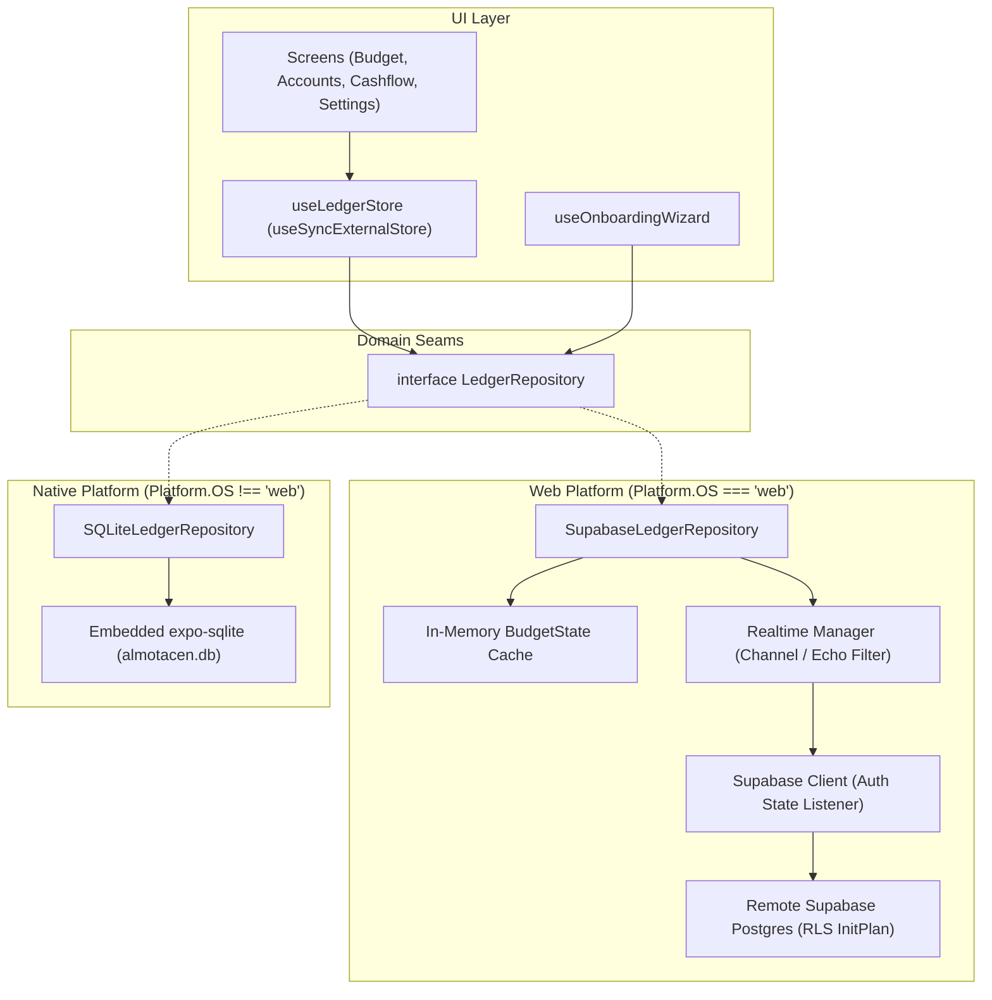
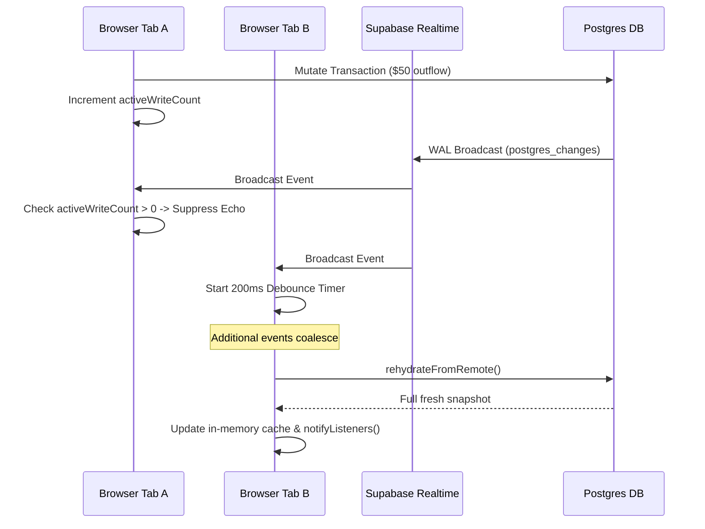

# Architecture & Technical Design: Web Supabase Hardening (Phase 2)

## 1. System Topology & Seams



---

## 2. Onboarding Seam Extension

The `LedgerRepository` interface is extended with the onboarding commitment contract:

```ts
export interface LedgerRepository {
  // Existing methods ...
  isOnboardingCompleted(): boolean;
  commitOnboardingConfig(config: ValidatedOnboardingConfig): void;
}
```

### `SupabaseLedgerRepository` Implementation
```ts
commitOnboardingConfig(config: ValidatedOnboardingConfig): void {
  this.executeOptimisticMutation(
    () => {
      // 1. Synchronously construct domain Accounts, CategoryGroups, and Categories
      // 2. Set readyToAssignCents to remainingReadyToAssignCents
      // 3. Set onboardingCompleted = true
      return { newState, newGroups, result: undefined };
    },
    async (userId) => {
      // 4. Batch idempotent upsert category_groups, accounts, categories, and metadata (onboarding_completed: true)
      await this.client.from('category_groups').upsert(groupRows).throwOnError();
      await this.client.from('accounts').upsert(accountRows).throwOnError();
      await this.client.from('categories').upsert(categoryRows).throwOnError();
      await this.client.from('metadata').upsert(metadataRows).throwOnError();
    }
  );
}
```

---

## 3. Realtime Coalesced Synchronization Design



### Echo Suppression Logic
- Maintain `private activeWriteCount = 0;` in `SupabaseLedgerRepository`.
- Before dispatching an optimistic mutation to Supabase, increment `activeWriteCount++`.
- Upon receiving a broadcast event on the channel:
  - If `activeWriteCount > 0`, decrement `activeWriteCount--` and skip re-hydration.
  - If `activeWriteCount === 0`, schedule debounced `rehydrateFromRemote()` after 200ms.

---

## 4. Postgres RLS Optimization & Realtime DDL

Migration: `supabase/migrations/20260930_optimize_rls_and_realtime.sql`

```sql
-- 1. Foreign Key Performance Indexes
CREATE INDEX IF NOT EXISTS idx_categories_credit_account ON categories(credit_account_id);
CREATE INDEX IF NOT EXISTS idx_transactions_transfer_account ON transactions(transfer_account_id);

-- 2. Publication for Realtime Broadcast
ALTER PUBLICATION supabase_realtime ADD TABLE accounts, category_groups, categories, transactions, metadata;

-- 3. Replace Policies with Cached InitPlan and Role Gate
-- (Example for accounts)
DROP POLICY IF EXISTS "Users can only read own accounts" ON accounts;
CREATE POLICY "Users can only read own accounts"
    ON accounts FOR SELECT
    TO authenticated
    USING ((select auth.uid()) = user_id);

DROP POLICY IF EXISTS "Users can only insert own accounts" ON accounts;
CREATE POLICY "Users can only insert own accounts"
    ON accounts FOR INSERT
    TO authenticated
    WITH CHECK ((select auth.uid()) = user_id);

DROP POLICY IF EXISTS "Users can only update own accounts" ON accounts;
CREATE POLICY "Users can only update own accounts"
    ON accounts FOR UPDATE
    TO authenticated
    USING ((select auth.uid()) = user_id)
    WITH CHECK ((select auth.uid()) = user_id);

DROP POLICY IF EXISTS "Users can only delete own accounts" ON accounts;
CREATE POLICY "Users can only delete own accounts"
    ON accounts FOR DELETE
    TO authenticated
    USING ((select auth.uid()) = user_id);
```

---

## 5. Auth State Lifecycle Handling
- In `client.ts`, expose auth state subscription handler.
- In `useLedgerStore.ts`, when `onAuthStateChange` emits `SIGNED_IN` or `TOKEN_REFRESHED`:
  - If the new user UUID differs from the active repository instance's `userId`, reset the repository instance and invoke `bootstrapWeb()` for the new user.
