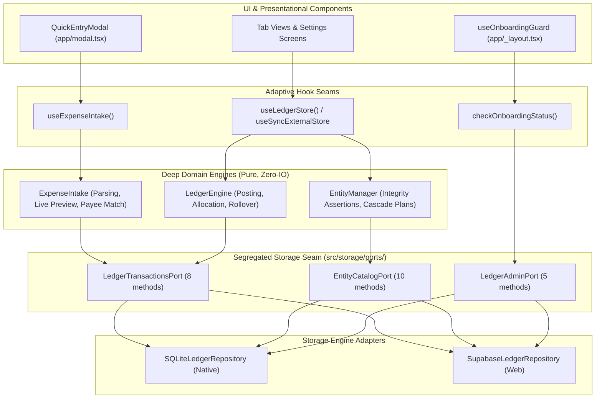

# Architecture & Technical Design: Codebase Architecture Deepening

## 1. System Topology & Deepened Seams



---

## 2. Deepened Seam Specifications

### A. Mandate 1: `EntityManager` Domain Module
- **Location**: `src/domain/ledger/entityManager.ts` (replacing `src/domain/ledger/entityOperations.ts`).
- **Core Abstraction**: An operations engine that evaluates entity integrity and outputs a deterministic `EntityMutationPlan`:
  ```typescript
  export interface EntityMutationPlan {
    deleteAccountIds: string[];
    deleteCategoryGroupIds: string[];
    deleteCategoryIds: string[];
    readyToAssignAdjustmentCents: number;
  }

  export class EntityManager {
    static planAccountDeletion(params: {
      account: Account;
      transactionCount: number;
      linkedPaymentCategory?: Category;
      linkedCategoryTransactionCount?: number;
    }): EntityMutationPlan;

    static planCategoryGroupDeletion(params: {
      groupId: string;
      childCategoryCount: number;
    }): EntityMutationPlan;

    static planCategoryDeletion(params: {
      category: Category;
      transactionCount: number;
    }): EntityMutationPlan;

    static planAccountCreation(input: CreateAccountInput): {
      account: Account;
      linkedPaymentCategory?: Category;
      linkedCategoryGroup?: CategoryGroup;
      readyToAssignInflowCents: number;
    };
  }
  ```
- **Leverage**: Eliminates the 9-step query dance previously duplicated across `SQLiteLedgerRepository` (lines 692–731) and `SupabaseLedgerRepository` (lines 1180–1240). Callers pass current entity state, and the engine guarantees integrity invariants.

---

### B. Mandate 2: Segregated Storage Ports & Store Streamlining
- **Location**: `src/storage/ports/` and `src/storage/useLedgerStore.ts`.
- **Port Segregation**:
  1. `LedgerTransactionsPort`: `getBudgetState`, `postOutflow`, `postInflow`, `allocateEnvelope`, `postCreditCardPayment`, `performMonthRollover`, `applyAutoAssign`, `rebalanceCategoryFunds`.
  2. `EntityCatalogPort`: `getCategoryGroups`, `createAccount`, `updateAccount`, `deleteAccount`, `createCategoryGroup`, `updateCategoryGroup`, `deleteCategoryGroup`, `createCategory`, `updateCategory`, `deleteCategory`.
  3. `LedgerAdminPort`: `resetDatabase`, `factoryReset`, `clearTransactionsOnly`, `seedDemoData`, `getDiagnostics`, `isOnboardingCompleted`, `commitOnboardingConfig`.
- **Boilerplate Reduction in `useLedgerStore.ts`**:
  - Replace 18 repetitive `useCallback` forwarders with direct repository dispatch or cohesive domain action delegates.
  - Preserve backward compatibility for existing screens (`app/(tabs)/*` and `app/settings/*`).

---

### C. Mandate 3: Onboarding Seam Consolidation & Adapter Independence
- **Actions**:
  1. Move the 115 lines of SQL insertion from `src/storage/onboardingRepository.ts` directly into `SQLiteLedgerRepository.commitOnboardingConfig()`.
  2. Delete `src/storage/onboardingRepository.ts`.
  3. Refactor `src/hooks/useOnboardingGuard.ts`:
     ```typescript
     export function checkOnboardingStatus(): boolean {
       const repo = getRepository();
       return repo.isOnboardingCompleted();
     }
     ```
     Remove all references to `DatabaseAdapter` or `db?.` branching from React hooks.

---

### D. Mandate 4: Encapsulated Point-of-Sale Expense Intake
- **Location**: `src/domain/ledger/expenseIntake.ts` and `src/hooks/useExpenseIntake.ts`.
- **Deep Module Responsibilities**:
  1. Parse currency input into exact integer cents (`parseCurrencyToCents`).
  2. Evaluate live balance impact (`remainingAvailableCents = category.availableCents - parsedCents`).
  3. Identify overspending type (`cash` vs `credit_debt`).
  4. Auto-select category and account based on smart payee memory.
  5. Validate required fields and dispatch `postOutflow` to the repository.
- **Refactored `app/modal.tsx`**:
  - Component drops from 601 lines to ~120 lines of pure JSX layout and form fields.
  - Consumes `useExpenseIntake()` which returns `{ draft, preview, setAmount, setPayee, selectCategory, selectAccount, submit, isSubmitting, error }`.
