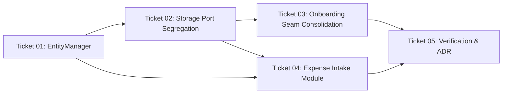

# Implementation Tasks: Codebase Architecture Deepening

This change is sliced into 5 atomic, test-driven tickets bound directly to behavioral scenarios in `spec-tests.md`.

---

## Ticket Overview

| Ticket | Title | Bound Scenarios | Primary Deliverable |
|---|---|---|---|
| **01** | `EntityManager` Domain Module & Integrity Consolidation | `SCEN-060`, `SCEN-061`, `SCEN-062` | Deep `EntityManager` module replacing `entityOperations.ts` + eliminate 9-step duplication in repos |
| **02** | Storage Port Segregation & Store Streamlining | `SCEN-063` | Segregate `LedgerRepository` into focused ports + delete 18 shallow wrappers in `useLedgerStore.ts` |
| **03** | Onboarding Seam Consolidation & Guard Decoupling | `SCEN-064` | Absorb `SQLiteOnboardingRepository` into SQLite repo + remove `DatabaseAdapter` from `useOnboardingGuard.ts` |
| **04** | Encapsulated Point-of-Sale Expense Intake Module | `SCEN-065`, `SCEN-066`, `SCEN-067` | Deep `ExpenseIntake` module + slim `app/modal.tsx` to pure presentation |
| **05** | Full Suite Verification, ADR Recording & Clean Pass | `SCEN-060`..`SCEN-067` | `./init.sh` green pass + record ADR-002 in `MEMORY.md` + regression audit |

---

## Ticket Dependencies

---

## Tasks Breakdown

### [Ticket 01: `EntityManager` Domain Module & Integrity Consolidation](./tickets/01-entity-manager-and-integrity.md)
- [x] Create `src/domain/ledger/entityManager.ts` implementing `planAccountDeletion`, `planCategoryDeletion`, `planCategoryGroupDeletion`, and `planAccountCreation`.
- [x] Author comprehensive unit tests in `src/domain/ledger/entityManager.test.ts` asserting `SCEN-060`, `SCEN-061`, and `SCEN-062`.
- [x] Refactor `SQLiteLedgerRepository` (`deleteAccount`, `deleteCategory`, `deleteCategoryGroup`, `createAccount`) to execute pre-computed mutation plans.
- [x] Refactor `SupabaseLedgerRepository` (`deleteAccount`, `deleteCategory`, `deleteCategoryGroup`, `createAccount`) to execute pre-computed mutation plans.
- [x] Deprecate or remove redundant micro-functions in `src/domain/ledger/entityOperations.ts`.

### [Ticket 02: Storage Port Segregation & Store Streamlining](./tickets/02-storage-port-segregation.md)
- [x] Define segregated interfaces in `src/storage/ports/` (`LedgerTransactionsPort`, `EntityCatalogPort`, `LedgerAdminPort`).
- [x] Compose `LedgerRepository` interface from the segregated ports in `src/storage/types.ts`.
- [x] Refactor `src/storage/useLedgerStore.ts` to eliminate 18 shallow `useCallback` boilerplate wrappers while maintaining backwards-compatible return contracts.
- [x] Author test in `src/storage/__tests__/` asserting port segregation and state notification dispatch (`SCEN-063`).

### [Ticket 03: Onboarding Seam Consolidation & Guard Decoupling](./tickets/03-onboarding-seam-consolidation.md)
- [x] Absorb `SQLiteOnboardingRepository` SQL execution directly into `SQLiteLedgerRepository.commitOnboardingConfig()`.
- [x] Delete `src/storage/onboardingRepository.ts`.
- [x] Refactor `src/hooks/useOnboardingGuard.ts` to query `LedgerRepository.isOnboardingCompleted()` without `DatabaseAdapter` branching.
- [x] Remove `DatabaseAdapter` imports and mock requirements from `useOnboardingGuard.test.ts` and `app/_layout.tsx`.
- [x] Verify `SCEN-064` pass rate.

### [Ticket 04: Encapsulated Point-of-Sale Expense Intake Module](./tickets/04-expense-intake-module.md)
- [x] Create `src/domain/ledger/expenseIntake.ts` implementing `parseCurrencyInput`, `previewExpenseImpact`, `resolvePayeeSuggestion`, and `submitExpense`.
- [x] Author unit tests in `src/domain/ledger/expenseIntake.test.ts` asserting `SCEN-065`, `SCEN-066`, and `SCEN-067`.
- [x] Create `src/hooks/useExpenseIntake.ts` integrating form state with the domain engine.
- [x] Refactor `app/modal.tsx` to consume `useExpenseIntake()`, reducing file length from 601 lines to < 150 lines.

### [Ticket 05: Full Suite Verification, ADR Recording & Clean Pass](./tickets/05-verification-and-adr.md)
- [x] Run `./init.sh` and verify 0 typecheck errors and 100% test pass rate across all test suites.
- [x] Record ADR-002 ("Deepened Domain Seams & Port Segregation") in `MEMORY.md`.
- [x] Verify zero regressions in existing tab navigation (`app/(tabs)/*`) and settings management (`app/settings/*`).
