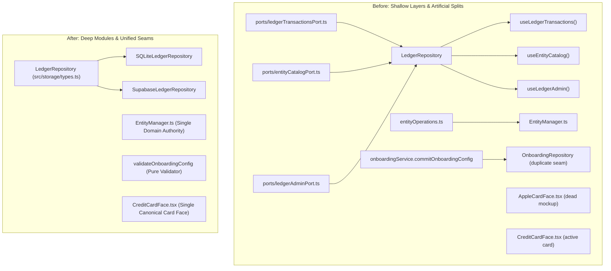

# Technical Design: Deep Module Consolidation & Seam Simplification

## 1. Architectural Strategy
We apply John Ousterhout's principle of **Module Depth**:
- **Deep modules** hide complex invariants and mechanisms behind compact interfaces.
- **Shallow modules** introduce interface surface area without hiding significant complexity.
- **Hypothetical seams** ("one adapter") add indirection without variance; **real seams** ("two adapters") allow swappable implementations.

## 2. File-by-File Changes
1. **`src/domain/ledger/entityOperations.ts`**:
   - Delete file.
   - Any consumers import directly from `src/domain/ledger/entityManager.ts`.
2. **`src/storage/useLedgerStore.ts`**:
   - Remove exports `useLedgerTransactions`, `useEntityCatalog`, and `useLedgerAdmin`.
   - Keep `useLedgerStore()` as the primary external store subscriber and `getRepository()` as the platform factory seam.
3. **`src/storage/ports/`**:
   - Merge `LedgerTransactionsPort`, `EntityCatalogPort`, and `LedgerAdminPort` directly into `LedgerRepository` in `src/storage/types.ts`.
   - Remove `src/storage/ports/` directory.
   - Refactor `src/storage/__tests__/portSegregation.test.ts` into `src/storage/__tests__/repositoryContract.test.ts`.
4. **`src/domain/onboarding/`**:
   - Remove `commitOnboardingConfig` and `OnboardingRepository` from `src/domain/onboarding/onboardingService.ts` and `types.ts`.
   - In `src/domain/onboarding/__tests__/onboardingService.test.ts`, test `validateOnboardingConfig` directly.
5. **`src/components/AppleCardFace.tsx`**:
   - Delete file.
   - Remove export from `src/components/index.ts`.
   - Update `src/components/__tests__/FinancialCardsAccessibility.test.tsx` to test `CreditCardFace` accessibility without AppleCardFace.
