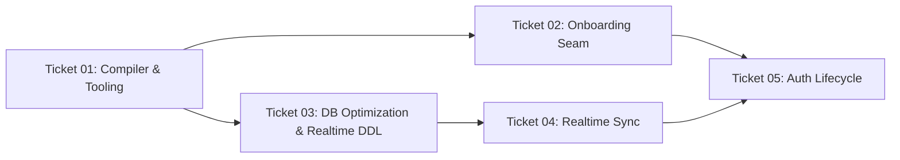

# Implementation Tasks: Web Supabase Hardening (Phase 2)

This change is sliced into 5 atomic, test-driven tickets bound directly to behavioral scenarios in `spec-tests.md`.

---

## Ticket Overview

| Ticket | Title | Bound Scenarios | Primary Deliverable |
|---|---|---|---|
| **01** | Compiler Baseline, Local Tooling & DX | `SCEN-009` | Revert TS to SDK 57 baseline + `.env.example` + `supabase/config.toml` + npm scripts |
| **02** | Platform-Agnostic Onboarding Storage Seam | `SCEN-010`, `SCEN-011` | Elevate `commitOnboardingConfig` to `LedgerRepository` + refactor `useOnboardingWizard` |
| **03** | DB Optimization, RLS InitPlan & Realtime DDL | `SCEN-012`, `SCEN-013` | Migration `20260930_optimize_rls_and_realtime.sql` with InitPlan RLS + FK indexes |
| **04** | Coalesced Realtime Synchronization | `SCEN-014`, `SCEN-015` | `SupabaseLedgerRepository` realtime channel subscription + echo suppression |
| **05** | Auth Lifecycle & Identity Switching | `SCEN-016`, `SCEN-017` | Reactive auth state listener + clean cache reset/re-hydration on user switch |

---

## Ticket Dependencies

---

## Tasks Breakdown

### [Ticket 01: Compiler Baseline, Local Tooling & DX](./tickets/01-compiler-baseline-and-dx.md)
- [x] Revert `typescript` in `package.json` to `"~6.0.3"` to restore `ts-jest` compatibility.
- [x] Run `npm install --legacy-peer-deps` and verify `./init.sh` green pass.
- [x] Create `.env.example` documenting `EXPO_PUBLIC_SUPABASE_URL` and `EXPO_PUBLIC_SUPABASE_ANON_KEY`.
- [x] Author `supabase/config.toml` configuring local ports and enabling anonymous auth (`auth.anonymous_users.enabled = true`).
- [x] Add `package.json` convenience scripts: `supabase:start`, `supabase:stop`, `supabase:reset`.

### [Ticket 02: Platform-Agnostic Onboarding Storage Seam](./tickets/02-onboarding-storage-seam.md)
- [ ] Add `commitOnboardingConfig(config: ValidatedOnboardingConfig): void` to `LedgerRepository` interface in `src/storage/types.ts`.
- [ ] Implement `commitOnboardingConfig` on `SQLiteLedgerRepository` delegating to SQLite transaction logic.
- [ ] Implement `commitOnboardingConfig` on `SupabaseLedgerRepository` with optimistic cache update and remote batch upserts.
- [ ] Refactor `src/hooks/useOnboardingWizard.ts` to accept `customRepo?: LedgerRepository` defaulting to `getRepository()`.
- [ ] Replace `executeExploreDemo(db, ...)` with `repo.seedDemoData()`.
- [ ] Author unit and integration tests verifying web onboarding without SQLite dependencies.

### [Ticket 03: DB Optimization, RLS InitPlan & Realtime DDL](./tickets/03-db-rls-optimization-and-realtime-ddl.md)
- [ ] Author migration `supabase/migrations/20260930_optimize_rls_and_realtime.sql`.
- [ ] Add foreign key indexes on `categories(credit_account_id)` and `transactions(transfer_account_id)`.
- [ ] Re-create all RLS policies with `TO authenticated` and `USING ((select auth.uid()) = user_id) WITH CHECK ((select auth.uid()) = user_id)`.
- [ ] Add tables to `supabase_realtime` publication.
- [ ] Verify SQL syntax and RLS behavior via test assertions.

### [Ticket 04: Coalesced Realtime Synchronization](./tickets/04-coalesced-realtime-sync.md)
- [ ] Add `client.channel('user-ledger')` subscription in `SupabaseLedgerRepository` listening to `postgres_changes`.
- [ ] Implement local write echo suppression using an active write counter.
- [ ] Implement debounced (200ms) re-hydration trigger invoking remote fetch and notifying store listeners.
- [ ] Provide cleanup / teardown mechanism on repository disposal.
- [ ] Write integration tests simulating multi-tab broadcast reception and echo filtering.

### [Ticket 05: Auth Lifecycle & Identity Switching](./tickets/05-auth-lifecycle-and-identity-switching.md)
- [ ] Integrate `onAuthStateChange` listener in `src/storage/supabase/client.ts` / `useLedgerStore.ts`.
- [ ] When `session.user.id !== currentUserId`, reset repository instance and invoke `bootstrapWeb()` for the new user.
- [ ] Verify zero-data-loss behavior when converting anonymous users via `updateUser`.
- [ ] Execute `./init.sh` to ensure 100% green verification pass across all 5 tickets.
