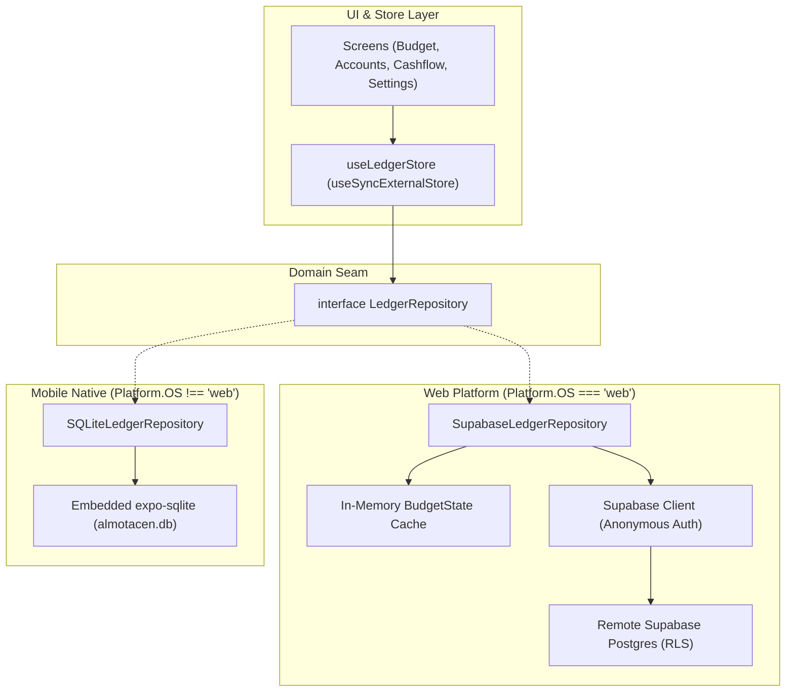
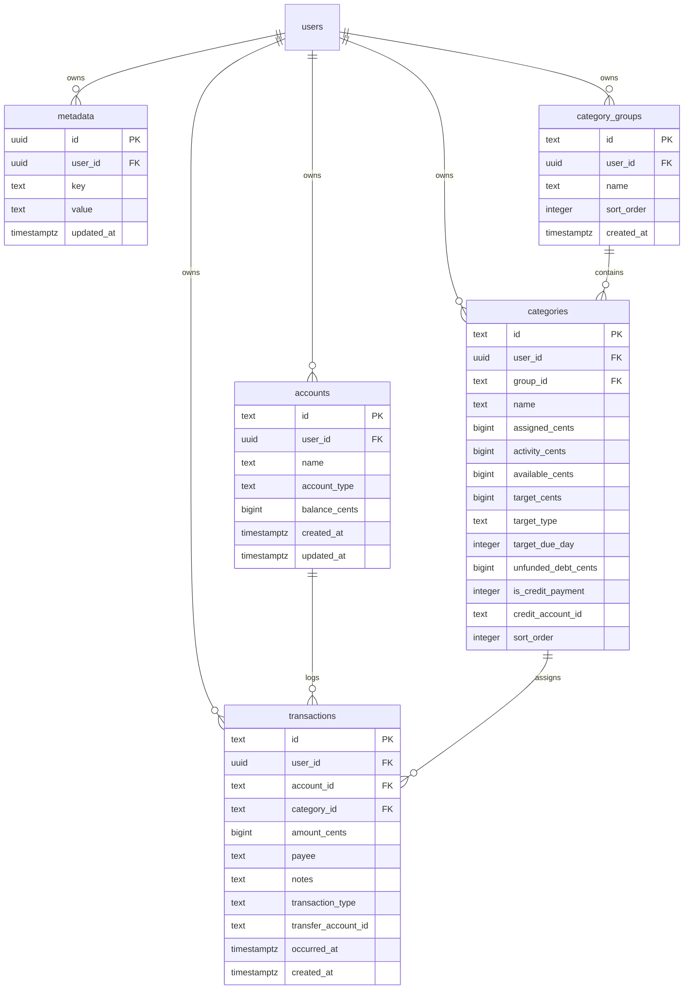

# Architecture & Technical Design: Web Supabase Integration (Phase 1)

## 1. Architectural Overview
This design implements a clean Hexagonal / Repository Seam architecture, allowing Almotacen to operate seamlessly across both Web and Mobile platforms without coupling UI or domain code to a specific database technology.



---

## 2. Postgres Schema & Entity Relationship Diagram (ERD)



---

## 3. Row Level Security (RLS) Policy Specifications
Every table in the Supabase schema enables RLS by default:
```sql
ALTER TABLE accounts ENABLE ROW LEVEL SECURITY;

CREATE POLICY "Users can only read own accounts"
ON accounts FOR SELECT
USING (auth.uid() = user_id);

CREATE POLICY "Users can only insert own accounts"
ON accounts FOR INSERT
WITH CHECK (auth.uid() = user_id);

CREATE POLICY "Users can only update own accounts"
ON accounts FOR UPDATE
USING (auth.uid() = user_id)
WITH CHECK (auth.uid() = user_id);

CREATE POLICY "Users can only delete own accounts"
ON accounts FOR DELETE
USING (auth.uid() = user_id);
```
*(Identical policies applied to `metadata`, `category_groups`, `categories`, and `transactions`)*.

---

## 4. `SupabaseLedgerRepository` Component Architecture
- **In-Memory Cache**: Maintains private `_state: BudgetState` and `_groups: CategoryGroup[]`.
- **Synchronous Getter Contract**:
  - `getBudgetState(): BudgetState => this._state`
  - `getCategoryGroups(): CategoryGroup[] => this._groups`
- **Optimistic Mutation Flow**:
  1. Capture current snapshot `const previousState = this._state;`.
  2. Compute next state synchronously using existing pure domain functions (`postOutflowTransaction`, `calculateDepositoryInflowOnCreation`, `allocateEnvelope`).
  3. Mutate local cache and notify external store listeners (`notifyListeners()`).
  4. Dispatch asynchronous Postgres query via `@supabase/supabase-js`.
  5. If query rejects, revert cache to `previousState`, notify listeners, and log/emit error.
