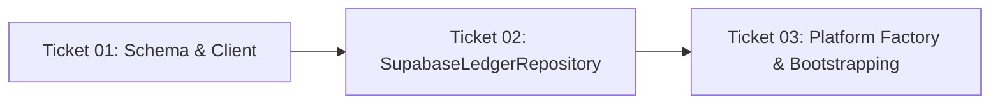

# Implementation Tasks: Web Supabase Integration (Phase 1)

This change is sliced into 3 atomic, test-driven tickets bound directly to behavioral scenarios in `spec-tests.md`.

---

## Ticket Overview

| Ticket | Title | Bound Scenarios | Primary Deliverable |
|---|---|---|---|
| **01** | Supabase Schema & Anonymous Client | `SCEN-001`, `SCEN-002`, `SCEN-003` | Postgres DDL migration script + `@supabase/supabase-js` client with anonymous auth |
| **02** | Cached Supabase Ledger Repository | `SCEN-004`, `SCEN-005`, `SCEN-006`, `SCEN-007` | `SupabaseLedgerRepository` implementation with in-memory cache and optimistic writes |
| **03** | Platform Factory & Web Bootstrapping | `SCEN-008` | Dynamic repository routing in `useLedgerStore` + web async hydration gate in `_layout.tsx` |

---

## Ticket Dependencies

---

## Tasks Breakdown

### [Ticket 01: Supabase Schema & Anonymous Client](./tickets/01-supabase-schema-and-client.md)
- [x] Add `@supabase/supabase-js` dependency to `package.json`.
- [x] Author `supabase/migrations/20260925_init_ledger_schema.sql` with tables: `metadata`, `accounts`, `category_groups`, `categories`, `transactions`.
- [x] Add RLS policies enforcing `auth.uid() = user_id` across all tables.
- [x] Implement `src/storage/supabase/client.ts` with anonymous auth bootstrap and environment credentials (`EXPO_PUBLIC_SUPABASE_URL`, `EXPO_PUBLIC_SUPABASE_ANON_KEY`).
- [x] Write unit tests verifying client initialization and type definitions.

### [Ticket 02: Cached Supabase Ledger Repository](./tickets/02-cached-supabase-ledger-repository.md)
- [x] Implement `SupabaseLedgerRepository` implementing `LedgerRepository` contract.
- [x] Implement `initializeAsync()` hydrating in-memory `BudgetState` cache from Postgres tables.
- [x] Implement synchronous getters: `getBudgetState()`, `getCategoryGroups()`.
- [x] Implement optimistic mutations with rollback on error:
  - `postOutflow`, `postInflow`, `allocateEnvelope`, `postCreditCardPayment`.
  - `createAccount`, `updateAccount`, `deleteAccount`.
  - `createCategoryGroup`, `updateCategoryGroup`, `deleteCategoryGroup`.
  - `createCategory`, `updateCategory`, `deleteCategory`.
  - `factoryReset`, `clearTransactionsOnly`, `seedDemoData`, `getDiagnostics`.
- [x] Write unit and integration tests with mocked Supabase client verifying cache hydration, optimistic state updates, and rollback invariants.

### [Ticket 03: Platform Factory & Web Bootstrapping](./tickets/03-platform-factory-and-web-bootstrapping.md)
- [ ] Update `src/storage/useLedgerStore.ts` repository factory to return `SupabaseLedgerRepository` when `Platform.OS === 'web'` and `SQLiteLedgerRepository` when `Platform.OS !== 'web'`.
- [ ] Integrate async bootstrap hook (`useWebBootstrap`) in `app/_layout.tsx` for web environments to await anonymous session and cache hydration before rendering navigation stack.
- [ ] Verify `./init.sh` green pass across all test suites and typechecks.
- [ ] Smoke test `npx expo start --web` ensuring clean launch on `http://localhost:8081`.
